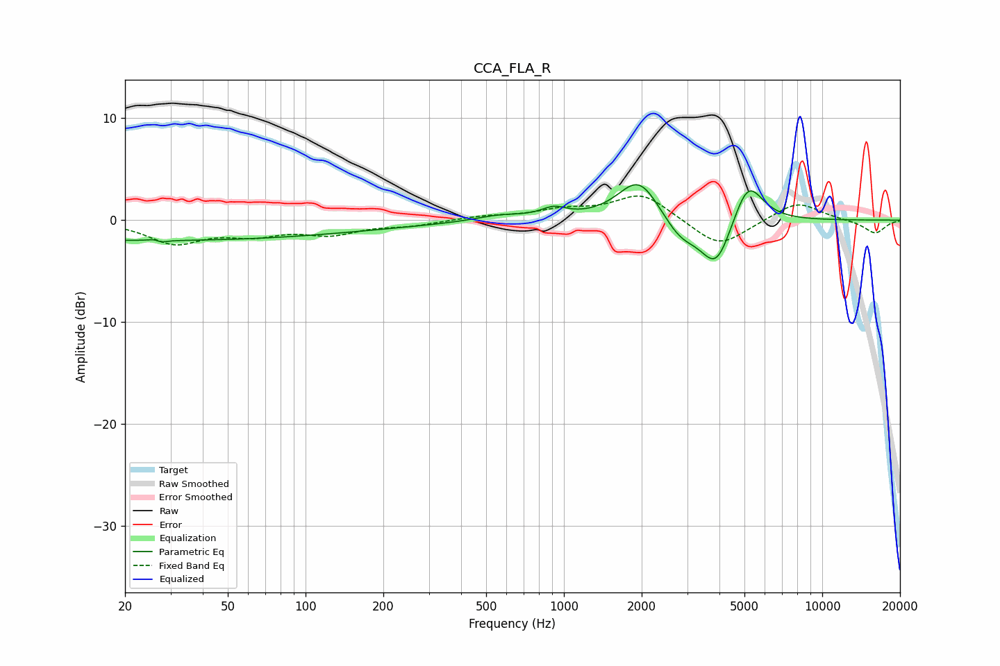

# CCA_FLA_R
See [usage instructions](https://github.com/jaakkopasanen/AutoEq#usage) for more options and info.

### Parametric EQs
Apply preamp of -3.6 dB when using parametric equalizer.

|   # | Type    |   Fc (Hz) |    Q |   Gain (dB) |
|-----|---------|-----------|------|-------------|
|   1 | Peaking |        20 | 0.18 |        -1.9 |
|   2 | Peaking |        27 | 5.96 |         2   |
|   3 | Peaking |        27 | 5.99 |        -2   |
|   4 | Peaking |       159 | 0.43 |        -0.5 |
|   5 | Peaking |       565 | 1.48 |         0.5 |
|   6 | Peaking |       914 | 2.82 |         0.9 |
|   7 | Peaking |      1954 | 1.75 |         4.3 |
|   8 | Peaking |      2825 | 2    |        -2.2 |
|   9 | Peaking |      3891 | 2.34 |        -4.8 |
|  10 | Peaking |      5150 | 2.4  |         4.4 |

### Fixed Band EQs
When using fixed band (also called graphic) equalizer, apply preamp of **-2.5 dB** (if available) and set gains manually with these parameters.

|   # | Type    |   Fc (Hz) |    Q |   Gain (dB) |
|-----|---------|-----------|------|-------------|
|   1 | Peaking |        31 | 1.41 |        -2.2 |
|   2 | Peaking |        62 | 1.41 |        -1.2 |
|   3 | Peaking |       125 | 1.41 |        -1.2 |
|   4 | Peaking |       250 | 1.41 |        -0.5 |
|   5 | Peaking |       500 | 1.41 |         0.4 |
|   6 | Peaking |      1000 | 1.41 |         0.9 |
|   7 | Peaking |      2000 | 1.41 |         2.6 |
|   8 | Peaking |      4000 | 1.41 |        -2.8 |
|   9 | Peaking |      8000 | 1.41 |         1.9 |
|  10 | Peaking |     16000 | 1.41 |        -1.3 |

### Graphs

