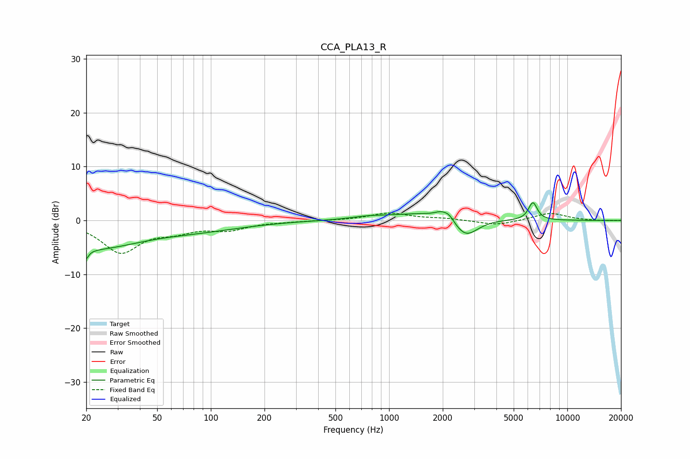

# CCA_PLA13_R
See [usage instructions](https://github.com/jaakkopasanen/AutoEq#usage) for more options and info.

### Parametric EQs
Apply preamp of -3.4 dB when using parametric equalizer.

|   # | Type    |   Fc (Hz) |    Q |   Gain (dB) |
|-----|---------|-----------|------|-------------|
|   1 | Peaking |        20 | 5.56 |        -5.4 |
|   2 | Peaking |        20 | 5.91 |         3.2 |
|   3 | Peaking |        23 | 0.58 |        -4.6 |
|   4 | Peaking |        85 | 0.53 |        -1.5 |
|   5 | Peaking |       760 | 1.54 |         0.4 |
|   6 | Peaking |      1629 | 0.69 |         1.4 |
|   7 | Peaking |      1980 | 3.68 |         1.2 |
|   8 | Peaking |      2182 | 5.65 |         0.9 |
|   9 | Peaking |      2696 | 2.07 |        -3.6 |
|  10 | Peaking |      6407 | 5.55 |         3.3 |

### Fixed Band EQs
When using fixed band (also called graphic) equalizer, apply preamp of **-1.5 dB** (if available) and set gains manually with these parameters.

|   # | Type    |   Fc (Hz) |    Q |   Gain (dB) |
|-----|---------|-----------|------|-------------|
|   1 | Peaking |        31 | 1.41 |        -5.8 |
|   2 | Peaking |        62 | 1.41 |        -1.6 |
|   3 | Peaking |       125 | 1.41 |        -1.5 |
|   4 | Peaking |       250 | 1.41 |        -0.2 |
|   5 | Peaking |       500 | 1.41 |        -0   |
|   6 | Peaking |      1000 | 1.41 |         1.4 |
|   7 | Peaking |      2000 | 1.41 |         0.3 |
|   8 | Peaking |      4000 | 1.41 |        -0.9 |
|   9 | Peaking |      8000 | 1.41 |         1.4 |
|  10 | Peaking |     16000 | 1.41 |        -0.1 |

### Graphs

