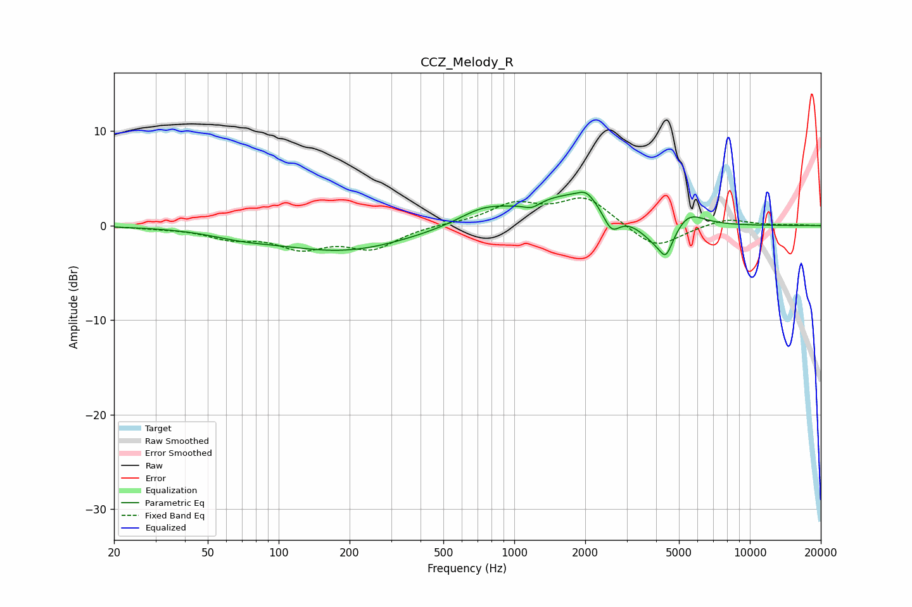

# CCZ_Melody_R
See [usage instructions](https://github.com/jaakkopasanen/AutoEq#usage) for more options and info.

### Parametric EQs
Apply preamp of -3.6 dB when using parametric equalizer.

|   # | Type    |   Fc (Hz) |    Q |   Gain (dB) |
|-----|---------|-----------|------|-------------|
|   1 | Peaking |        70 | 1.06 |        -0.6 |
|   2 | Peaking |       188 | 0.51 |        -2.6 |
|   3 | Peaking |       734 | 1.35 |         1.4 |
|   4 | Peaking |      1187 | 4.08 |        -0.7 |
|   5 | Peaking |      1811 | 0.72 |         3.4 |
|   6 | Peaking |      2022 | 4    |         0.9 |
|   7 | Peaking |      2586 | 3.9  |        -2.3 |
|   8 | Peaking |      4356 | 1.57 |        -4.4 |
|   9 | Peaking |      4401 | 6    |        -1.5 |
|  10 | Peaking |      5309 | 1.88 |         3   |

### Fixed Band EQs
When using fixed band (also called graphic) equalizer, apply preamp of **-3.0 dB** (if available) and set gains manually with these parameters.

|   # | Type    |   Fc (Hz) |    Q |   Gain (dB) |
|-----|---------|-----------|------|-------------|
|   1 | Peaking |        31 | 1.41 |        -0.2 |
|   2 | Peaking |        62 | 1.41 |        -1.1 |
|   3 | Peaking |       125 | 1.41 |        -2.1 |
|   4 | Peaking |       250 | 1.41 |        -2.3 |
|   5 | Peaking |       500 | 1.41 |         0.1 |
|   6 | Peaking |      1000 | 1.41 |         2.1 |
|   7 | Peaking |      2000 | 1.41 |         2.9 |
|   8 | Peaking |      4000 | 1.41 |        -2.5 |
|   9 | Peaking |      8000 | 1.41 |         0.8 |
|  10 | Peaking |     16000 | 1.41 |         0.1 |

### Graphs

