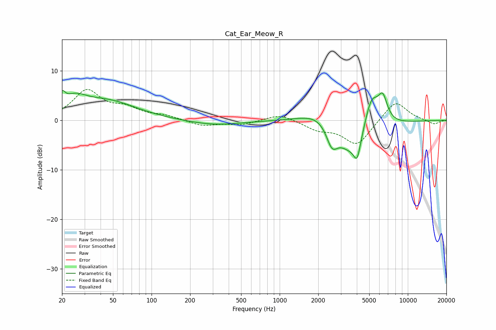

# Cat_Ear_Meow_R
See [usage instructions](https://github.com/jaakkopasanen/AutoEq#usage) for more options and info.

### Parametric EQs
Apply preamp of -6.1 dB when using parametric equalizer.

|   # | Type    |   Fc (Hz) |    Q |   Gain (dB) |
|-----|---------|-----------|------|-------------|
|   1 | Peaking |        20 | 5.98 |         2.4 |
|   2 | Peaking |        25 | 1.54 |         2.9 |
|   3 | Peaking |        45 | 0.62 |         3.7 |
|   4 | Peaking |       309 | 0.68 |        -1   |
|   5 | Peaking |      2127 | 0.95 |         3.2 |
|   6 | Peaking |      2557 | 3.23 |        -4.1 |
|   7 | Peaking |      3763 | 1.01 |        -8.3 |
|   8 | Peaking |      4024 | 5.62 |        -3.7 |
|   9 | Peaking |      5186 | 2.21 |         8.1 |
|  10 | Peaking |      6375 | 3.78 |         4.7 |

### Fixed Band EQs
When using fixed band (also called graphic) equalizer, apply preamp of **-6.3 dB** (if available) and set gains manually with these parameters.

|   # | Type    |   Fc (Hz) |    Q |   Gain (dB) |
|-----|---------|-----------|------|-------------|
|   1 | Peaking |        31 | 1.41 |         5.8 |
|   2 | Peaking |        62 | 1.41 |         2   |
|   3 | Peaking |       125 | 1.41 |         0.8 |
|   4 | Peaking |       250 | 1.41 |        -1.1 |
|   5 | Peaking |       500 | 1.41 |        -0.8 |
|   6 | Peaking |      1000 | 1.41 |         1.4 |
|   7 | Peaking |      2000 | 1.41 |        -1.7 |
|   8 | Peaking |      4000 | 1.41 |        -5   |
|   9 | Peaking |      8000 | 1.41 |         4.1 |
|  10 | Peaking |     16000 | 1.41 |        -0.9 |

### Graphs

