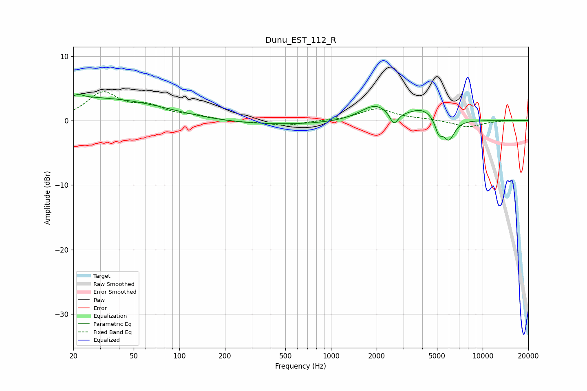

# Dunu_EST_112_R
See [usage instructions](https://github.com/jaakkopasanen/AutoEq#usage) for more options and info.

### Parametric EQs
Apply preamp of -4.2 dB when using parametric equalizer.

|   # | Type    |   Fc (Hz) |    Q |   Gain (dB) |
|-----|---------|-----------|------|-------------|
|   1 | Peaking |        22 | 5.83 |         3.2 |
|   2 | Peaking |        22 | 6    |        -2.7 |
|   3 | Peaking |        23 | 0.24 |         3.6 |
|   4 | Peaking |       105 | 0.89 |        -0.1 |
|   5 | Peaking |       401 | 0.3  |        -0.7 |
|   6 | Peaking |      1954 | 1.44 |         2.4 |
|   7 | Peaking |      2601 | 5.17 |        -2.1 |
|   8 | Peaking |      4038 | 1.57 |         1.7 |
|   9 | Peaking |      5132 | 5.99 |        -2.1 |
|  10 | Peaking |      5980 | 3.56 |        -3.3 |

### Fixed Band EQs
When using fixed band (also called graphic) equalizer, apply preamp of **-4.6 dB** (if available) and set gains manually with these parameters.

|   # | Type    |   Fc (Hz) |    Q |   Gain (dB) |
|-----|---------|-----------|------|-------------|
|   1 | Peaking |        31 | 1.41 |         4.1 |
|   2 | Peaking |        62 | 1.41 |         1.9 |
|   3 | Peaking |       125 | 1.41 |         0.6 |
|   4 | Peaking |       250 | 1.41 |        -0.3 |
|   5 | Peaking |       500 | 1.41 |        -0.8 |
|   6 | Peaking |      1000 | 1.41 |        -0   |
|   7 | Peaking |      2000 | 1.41 |         1.8 |
|   8 | Peaking |      4000 | 1.41 |         0.2 |
|   9 | Peaking |      8000 | 1.41 |        -1   |
|  10 | Peaking |     16000 | 1.41 |         0.1 |

### Graphs

