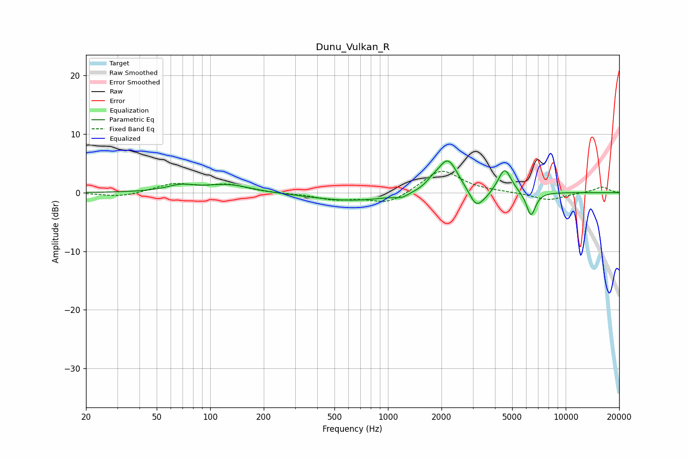

# Dunu_Vulkan_R
See [usage instructions](https://github.com/jaakkopasanen/AutoEq#usage) for more options and info.

### Parametric EQs
Apply preamp of -5.5 dB when using parametric equalizer.

|   # | Type    |   Fc (Hz) |    Q |   Gain (dB) |
|-----|---------|-----------|------|-------------|
|   1 | Peaking |        68 | 1.73 |         1.1 |
|   2 | Peaking |       127 | 1.13 |         1.3 |
|   3 | Peaking |       630 | 0.62 |        -1.4 |
|   4 | Peaking |      1196 | 4.01 |        -0.6 |
|   5 | Peaking |      1776 | 3.95 |         0.7 |
|   6 | Peaking |      2170 | 2.45 |         5.8 |
|   7 | Peaking |      3130 | 3.67 |        -2.9 |
|   8 | Peaking |      3531 | 3.22 |        -0.8 |
|   9 | Peaking |      4539 | 3.82 |         4.2 |
|  10 | Peaking |      6378 | 5.29 |        -4.2 |

### Fixed Band EQs
When using fixed band (also called graphic) equalizer, apply preamp of **-3.7 dB** (if available) and set gains manually with these parameters.

|   # | Type    |   Fc (Hz) |    Q |   Gain (dB) |
|-----|---------|-----------|------|-------------|
|   1 | Peaking |        31 | 1.41 |        -0.8 |
|   2 | Peaking |        62 | 1.41 |         1.5 |
|   3 | Peaking |       125 | 1.41 |         1.3 |
|   4 | Peaking |       250 | 1.41 |        -0.1 |
|   5 | Peaking |       500 | 1.41 |        -1.1 |
|   6 | Peaking |      1000 | 1.41 |        -2   |
|   7 | Peaking |      2000 | 1.41 |         4   |
|   8 | Peaking |      4000 | 1.41 |         0.1 |
|   9 | Peaking |      8000 | 1.41 |        -1.3 |
|  10 | Peaking |     16000 | 1.41 |         1   |

### Graphs

