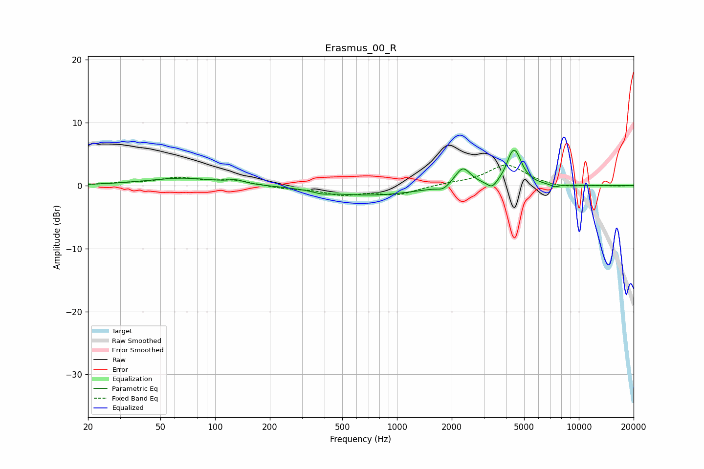

# Erasmus_00_R
See [usage instructions](https://github.com/jaakkopasanen/AutoEq#usage) for more options and info.

### Parametric EQs
Apply preamp of -5.7 dB when using parametric equalizer.

|   # | Type    |   Fc (Hz) |    Q |   Gain (dB) |
|-----|---------|-----------|------|-------------|
|   1 | Peaking |        66 | 0.71 |         1.2 |
|   2 | Peaking |       131 | 3.37 |         0.5 |
|   3 | Peaking |       388 | 2.97 |        -0.4 |
|   4 | Peaking |       715 | 0.57 |        -1.5 |
|   5 | Peaking |      1799 | 4.65 |        -0.7 |
|   6 | Peaking |      2301 | 3.29 |         3   |
|   7 | Peaking |      3334 | 5.31 |        -1.2 |
|   8 | Peaking |      4226 | 5.64 |         1   |
|   9 | Peaking |      4456 | 3.59 |         5   |
|  10 | Peaking |      7377 | 5.99 |        -0.4 |

### Fixed Band EQs
When using fixed band (also called graphic) equalizer, apply preamp of **-3.3 dB** (if available) and set gains manually with these parameters.

|   # | Type    |   Fc (Hz) |    Q |   Gain (dB) |
|-----|---------|-----------|------|-------------|
|   1 | Peaking |        31 | 1.41 |         0.3 |
|   2 | Peaking |        62 | 1.41 |         1.1 |
|   3 | Peaking |       125 | 1.41 |         0.8 |
|   4 | Peaking |       250 | 1.41 |        -0.4 |
|   5 | Peaking |       500 | 1.41 |        -1.3 |
|   6 | Peaking |      1000 | 1.41 |        -1.4 |
|   7 | Peaking |      2000 | 1.41 |         0.3 |
|   8 | Peaking |      4000 | 1.41 |         3.3 |
|   9 | Peaking |      8000 | 1.41 |        -0.4 |
|  10 | Peaking |     16000 | 1.41 |        -0.1 |

### Graphs

