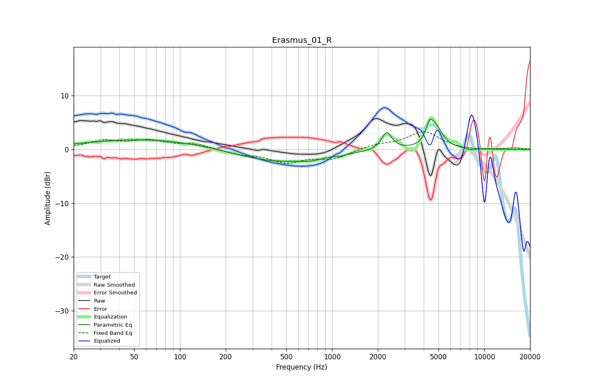

# Erasmus_01_R
See [usage instructions](https://github.com/jaakkopasanen/AutoEq#usage) for more options and info.

### Parametric EQs
Apply preamp of -5.7 dB when using parametric equalizer.

|   # | Type    |   Fc (Hz) |    Q |   Gain (dB) |
|-----|---------|-----------|------|-------------|
|   1 | Peaking |        64 | 0.33 |         2   |
|   2 | Peaking |        97 | 1.04 |        -0.1 |
|   3 | Peaking |       442 | 0.47 |        -2.5 |
|   4 | Peaking |       730 | 2.94 |        -0.4 |
|   5 | Peaking |      1129 | 5.6  |        -0.2 |
|   6 | Peaking |      2275 | 4.61 |        -0.9 |
|   7 | Peaking |      2284 | 4.33 |         4.2 |
|   8 | Peaking |      4364 | 6    |         2.8 |
|   9 | Peaking |      4790 | 3.1  |         3.8 |
|  10 | Peaking |      8115 | 4.83 |        -0.3 |

### Fixed Band EQs
When using fixed band (also called graphic) equalizer, apply preamp of **-3.4 dB** (if available) and set gains manually with these parameters.

|   # | Type    |   Fc (Hz) |    Q |   Gain (dB) |
|-----|---------|-----------|------|-------------|
|   1 | Peaking |        31 | 1.41 |         1.5 |
|   2 | Peaking |        62 | 1.41 |         1.5 |
|   3 | Peaking |       125 | 1.41 |         0.9 |
|   4 | Peaking |       250 | 1.41 |        -0.8 |
|   5 | Peaking |       500 | 1.41 |        -2.3 |
|   6 | Peaking |      1000 | 1.41 |        -1.6 |
|   7 | Peaking |      2000 | 1.41 |         0.8 |
|   8 | Peaking |      4000 | 1.41 |         3.2 |
|   9 | Peaking |      8000 | 1.41 |        -0.2 |
|  10 | Peaking |     16000 | 1.41 |         0.3 |

### Graphs

