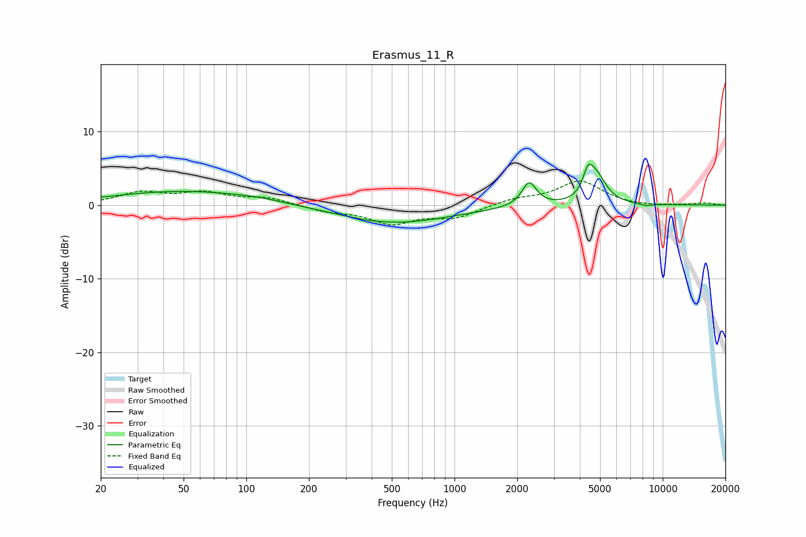

# Erasmus_11_R
See [usage instructions](https://github.com/jaakkopasanen/AutoEq#usage) for more options and info.

### Parametric EQs
Apply preamp of -5.7 dB when using parametric equalizer.

|   # | Type    |   Fc (Hz) |    Q |   Gain (dB) |
|-----|---------|-----------|------|-------------|
|   1 | Peaking |        21 | 5.96 |        -0   |
|   2 | Peaking |        51 | 0.4  |         1.9 |
|   3 | Peaking |       114 | 1.39 |         0.2 |
|   4 | Peaking |       394 | 3.05 |        -0.1 |
|   5 | Peaking |       516 | 0.52 |        -2.4 |
|   6 | Peaking |      2284 | 4.59 |        -1.2 |
|   7 | Peaking |      2284 | 4.21 |         4.5 |
|   8 | Peaking |      4378 | 6    |         2.7 |
|   9 | Peaking |      4800 | 3    |         3.7 |
|  10 | Peaking |      8280 | 4.77 |        -0.3 |

### Fixed Band EQs
When using fixed band (also called graphic) equalizer, apply preamp of **-3.4 dB** (if available) and set gains manually with these parameters.

|   # | Type    |   Fc (Hz) |    Q |   Gain (dB) |
|-----|---------|-----------|------|-------------|
|   1 | Peaking |        31 | 1.41 |         1.6 |
|   2 | Peaking |        62 | 1.41 |         1.5 |
|   3 | Peaking |       125 | 1.41 |         0.9 |
|   4 | Peaking |       250 | 1.41 |        -0.8 |
|   5 | Peaking |       500 | 1.41 |        -2.3 |
|   6 | Peaking |      1000 | 1.41 |        -1.6 |
|   7 | Peaking |      2000 | 1.41 |         0.8 |
|   8 | Peaking |      4000 | 1.41 |         3.2 |
|   9 | Peaking |      8000 | 1.41 |        -0.2 |
|  10 | Peaking |     16000 | 1.41 |         0.3 |

### Graphs

