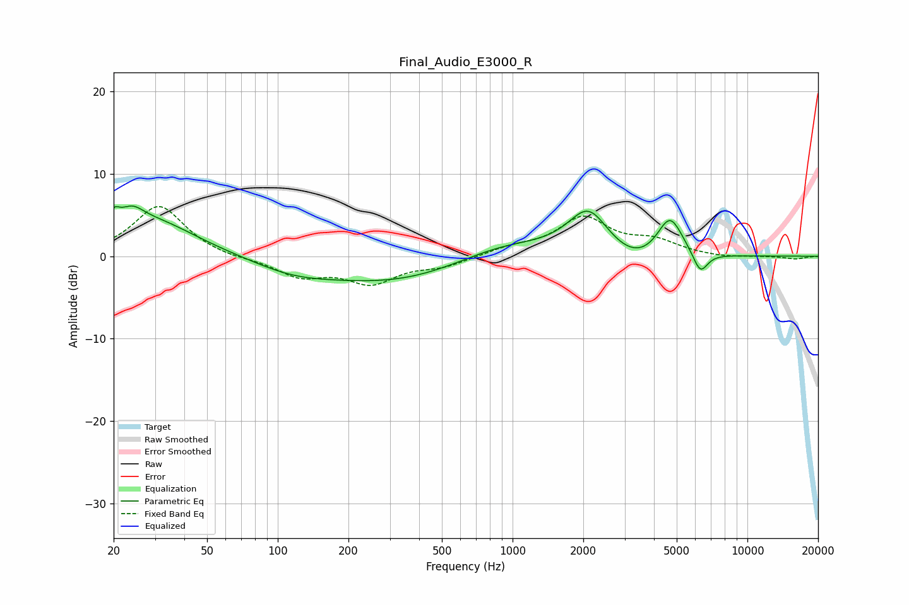

# Final_Audio_E3000_R
See [usage instructions](https://github.com/jaakkopasanen/AutoEq#usage) for more options and info.

### Parametric EQs
Apply preamp of -6.2 dB when using parametric equalizer.

|   # | Type    |   Fc (Hz) |    Q |   Gain (dB) |
|-----|---------|-----------|------|-------------|
|   1 | Peaking |        20 | 5.57 |         1.8 |
|   2 | Peaking |        24 | 2.78 |         2   |
|   3 | Peaking |        29 | 0.75 |         4.2 |
|   4 | Peaking |       115 | 0.84 |        -1.3 |
|   5 | Peaking |       320 | 0.43 |        -3.2 |
|   6 | Peaking |       901 | 0.66 |         2.2 |
|   7 | Peaking |      2107 | 1.61 |         5.7 |
|   8 | Peaking |      3371 | 1.07 |        -2   |
|   9 | Peaking |      4676 | 2.5  |         5.2 |
|  10 | Peaking |      6302 | 4.36 |        -2.6 |

### Fixed Band EQs
When using fixed band (also called graphic) equalizer, apply preamp of **-6.1 dB** (if available) and set gains manually with these parameters.

|   # | Type    |   Fc (Hz) |    Q |   Gain (dB) |
|-----|---------|-----------|------|-------------|
|   1 | Peaking |        31 | 1.41 |         6.2 |
|   2 | Peaking |        62 | 1.41 |        -0.3 |
|   3 | Peaking |       125 | 1.41 |        -2.3 |
|   4 | Peaking |       250 | 1.41 |        -3   |
|   5 | Peaking |       500 | 1.41 |        -1.1 |
|   6 | Peaking |      1000 | 1.41 |         0.9 |
|   7 | Peaking |      2000 | 1.41 |         4.5 |
|   8 | Peaking |      4000 | 1.41 |         1.6 |
|   9 | Peaking |      8000 | 1.41 |        -0.2 |
|  10 | Peaking |     16000 | 1.41 |        -0.3 |

### Graphs

