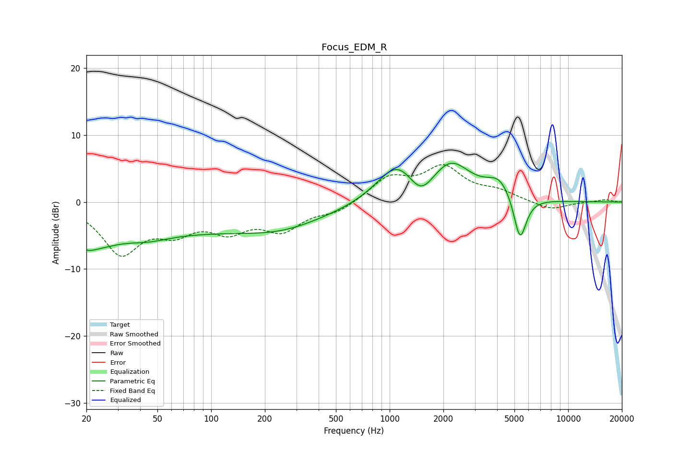

# Focus_EDM_R
See [usage instructions](https://github.com/jaakkopasanen/AutoEq#usage) for more options and info.

### Parametric EQs
Apply preamp of -5.9 dB when using parametric equalizer.

|   # | Type    |   Fc (Hz) |    Q |   Gain (dB) |
|-----|---------|-----------|------|-------------|
|   1 | Peaking |        20 | 3.45 |        -0.9 |
|   2 | Peaking |        21 | 1.04 |        -3.3 |
|   3 | Peaking |        45 | 1.16 |        -1   |
|   4 | Peaking |        82 | 0.18 |        -4.2 |
|   5 | Peaking |       249 | 0.73 |        -1   |
|   6 | Peaking |      1102 | 1.25 |         5.7 |
|   7 | Peaking |      1495 | 2.04 |        -3.4 |
|   8 | Peaking |      2205 | 1.27 |         5.4 |
|   9 | Peaking |      4138 | 1.95 |         2.9 |
|  10 | Peaking |      5372 | 3.86 |        -7   |

### Fixed Band EQs
When using fixed band (also called graphic) equalizer, apply preamp of **-5.7 dB** (if available) and set gains manually with these parameters.

|   # | Type    |   Fc (Hz) |    Q |   Gain (dB) |
|-----|---------|-----------|------|-------------|
|   1 | Peaking |        31 | 1.41 |        -7.3 |
|   2 | Peaking |        62 | 1.41 |        -3.5 |
|   3 | Peaking |       125 | 1.41 |        -3.6 |
|   4 | Peaking |       250 | 1.41 |        -3.8 |
|   5 | Peaking |       500 | 1.41 |        -1.4 |
|   6 | Peaking |      1000 | 1.41 |         3.5 |
|   7 | Peaking |      2000 | 1.41 |         4.8 |
|   8 | Peaking |      4000 | 1.41 |         1.3 |
|   9 | Peaking |      8000 | 1.41 |        -1.2 |
|  10 | Peaking |     16000 | 1.41 |         0.4 |

### Graphs

