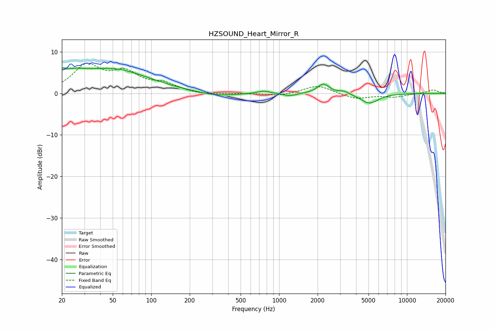

# HZSOUND_Heart_Mirror_R
See [usage instructions](https://github.com/jaakkopasanen/AutoEq#usage) for more options and info.

### Parametric EQs
Apply preamp of -6.2 dB when using parametric equalizer.

|   # | Type    |   Fc (Hz) |    Q |   Gain (dB) |
|-----|---------|-----------|------|-------------|
|   1 | Peaking |        20 | 5.83 |         1.5 |
|   2 | Peaking |        24 | 1.41 |         2.5 |
|   3 | Peaking |        51 | 0.51 |         5.6 |
|   4 | Peaking |       227 | 5.4  |         0   |
|   5 | Peaking |       320 | 0.95 |        -0.9 |
|   6 | Peaking |       758 | 2.93 |         0.7 |
|   7 | Peaking |      1213 | 2.81 |        -0.7 |
|   8 | Peaking |      2222 | 3.05 |         2.3 |
|   9 | Peaking |      3229 | 4.01 |         0.7 |
|  10 | Peaking |      5090 | 2.01 |        -2.4 |

### Fixed Band EQs
When using fixed band (also called graphic) equalizer, apply preamp of **-7.4 dB** (if available) and set gains manually with these parameters.

|   # | Type    |   Fc (Hz) |    Q |   Gain (dB) |
|-----|---------|-----------|------|-------------|
|   1 | Peaking |        31 | 1.41 |         6.4 |
|   2 | Peaking |        62 | 1.41 |         4.4 |
|   3 | Peaking |       125 | 1.41 |         2   |
|   4 | Peaking |       250 | 1.41 |        -0.4 |
|   5 | Peaking |       500 | 1.41 |        -0   |
|   6 | Peaking |      1000 | 1.41 |        -0.6 |
|   7 | Peaking |      2000 | 1.41 |         2   |
|   8 | Peaking |      4000 | 1.41 |        -1.3 |
|   9 | Peaking |      8000 | 1.41 |        -0.8 |
|  10 | Peaking |     16000 | 1.41 |         0.8 |

### Graphs

