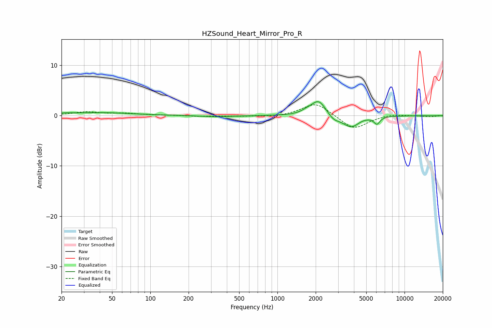

# HZSound_Heart_Mirror_Pro_R
See [usage instructions](https://github.com/jaakkopasanen/AutoEq#usage) for more options and info.

### Parametric EQs
Apply preamp of -2.9 dB when using parametric equalizer.

|   # | Type    |   Fc (Hz) |    Q |   Gain (dB) |
|-----|---------|-----------|------|-------------|
|   1 | Peaking |        21 | 3.41 |         0.2 |
|   2 | Peaking |        40 | 0.55 |         0.6 |
|   3 | Peaking |       334 | 1.2  |        -0.2 |
|   4 | Peaking |      1702 | 3.57 |         0.4 |
|   5 | Peaking |      1976 | 1.92 |         0.5 |
|   6 | Peaking |      2118 | 2.62 |         2.7 |
|   7 | Peaking |      2778 | 3.31 |        -0.9 |
|   8 | Peaking |      3795 | 2.09 |        -2.3 |
|   9 | Peaking |      4673 | 3.96 |         0.1 |
|  10 | Peaking |      6067 | 6    |        -1.4 |

### Fixed Band EQs
When using fixed band (also called graphic) equalizer, apply preamp of **-2.3 dB** (if available) and set gains manually with these parameters.

|   # | Type    |   Fc (Hz) |    Q |   Gain (dB) |
|-----|---------|-----------|------|-------------|
|   1 | Peaking |        31 | 1.41 |         0.7 |
|   2 | Peaking |        62 | 1.41 |         0.4 |
|   3 | Peaking |       125 | 1.41 |         0.1 |
|   4 | Peaking |       250 | 1.41 |        -0.1 |
|   5 | Peaking |       500 | 1.41 |        -0.1 |
|   6 | Peaking |      1000 | 1.41 |        -0.3 |
|   7 | Peaking |      2000 | 1.41 |         2.7 |
|   8 | Peaking |      4000 | 1.41 |        -2.8 |
|   9 | Peaking |      8000 | 1.41 |         0.3 |
|  10 | Peaking |     16000 | 1.41 |        -0.2 |

### Graphs

