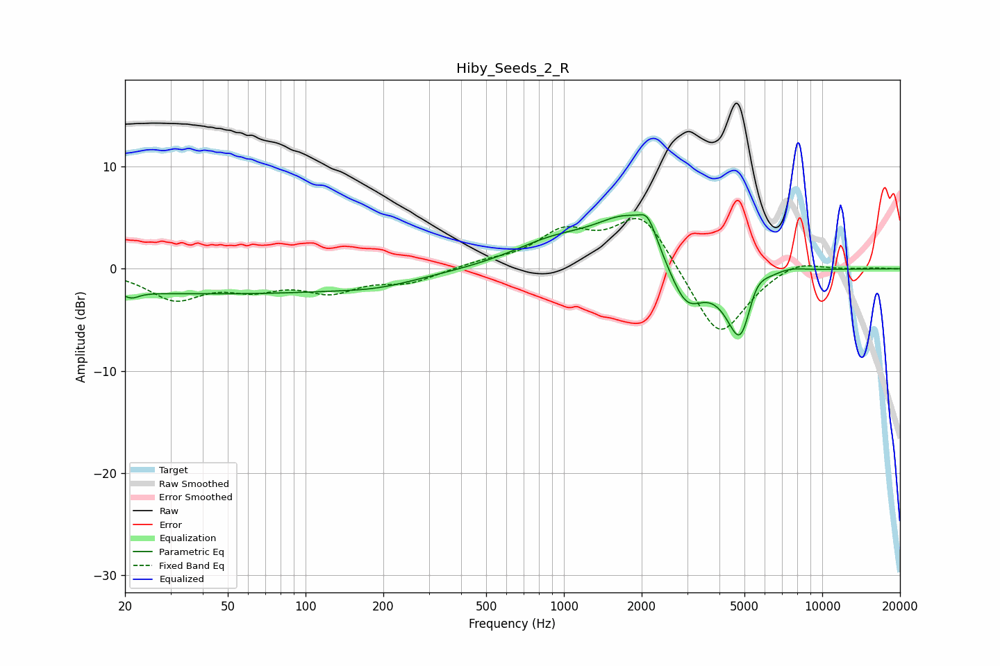

# Hiby_Seeds_2_R
See [usage instructions](https://github.com/jaakkopasanen/AutoEq#usage) for more options and info.

### Parametric EQs
Apply preamp of -5.4 dB when using parametric equalizer.

|   # | Type    |   Fc (Hz) |    Q |   Gain (dB) |
|-----|---------|-----------|------|-------------|
|   1 | Peaking |        21 | 4.89 |        -0.6 |
|   2 | Peaking |        43 | 0.18 |        -2.4 |
|   3 | Peaking |       192 | 1    |        -0.5 |
|   4 | Peaking |       913 | 0.84 |         2.3 |
|   5 | Peaking |      1791 | 1.11 |         4.7 |
|   6 | Peaking |      2113 | 4.3  |         2.1 |
|   7 | Peaking |      2965 | 2.02 |        -4.6 |
|   8 | Peaking |      4861 | 2.46 |        -8.5 |
|   9 | Peaking |      5444 | 2.89 |         3.2 |
|  10 | Peaking |      7383 | 1.94 |         0.6 |

### Fixed Band EQs
When using fixed band (also called graphic) equalizer, apply preamp of **-5.0 dB** (if available) and set gains manually with these parameters.

|   # | Type    |   Fc (Hz) |    Q |   Gain (dB) |
|-----|---------|-----------|------|-------------|
|   1 | Peaking |        31 | 1.41 |        -2.8 |
|   2 | Peaking |        62 | 1.41 |        -1.6 |
|   3 | Peaking |       125 | 1.41 |        -2   |
|   4 | Peaking |       250 | 1.41 |        -1.2 |
|   5 | Peaking |       500 | 1.41 |         0.5 |
|   6 | Peaking |      1000 | 1.41 |         3.3 |
|   7 | Peaking |      2000 | 1.41 |         5.5 |
|   8 | Peaking |      4000 | 1.41 |        -7.1 |
|   9 | Peaking |      8000 | 1.41 |         1.1 |
|  10 | Peaking |     16000 | 1.41 |         0.1 |

### Graphs

