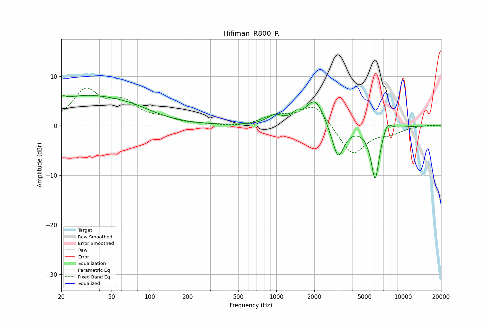

# Hifiman_R800_R
See [usage instructions](https://github.com/jaakkopasanen/AutoEq#usage) for more options and info.

### Parametric EQs
Apply preamp of -6.2 dB when using parametric equalizer.

|   # | Type    |   Fc (Hz) |    Q |   Gain (dB) |
|-----|---------|-----------|------|-------------|
|   1 | Peaking |        20 | 5.83 |        -2.7 |
|   2 | Peaking |        20 | 5.6  |         3.4 |
|   3 | Peaking |        31 | 0.43 |         5.8 |
|   4 | Peaking |        74 | 0.87 |         1.2 |
|   5 | Peaking |       973 | 2.43 |         1.8 |
|   6 | Peaking |      1424 | 4.63 |         1.1 |
|   7 | Peaking |      2024 | 1.91 |         5.6 |
|   8 | Peaking |      3074 | 2.91 |        -7.1 |
|   9 | Peaking |      6041 | 3.98 |       -10.9 |
|  10 | Peaking |      7520 | 3.85 |         2.2 |

### Fixed Band EQs
When using fixed band (also called graphic) equalizer, apply preamp of **-7.7 dB** (if available) and set gains manually with these parameters.

|   # | Type    |   Fc (Hz) |    Q |   Gain (dB) |
|-----|---------|-----------|------|-------------|
|   1 | Peaking |        31 | 1.41 |         6.8 |
|   2 | Peaking |        62 | 1.41 |         4.1 |
|   3 | Peaking |       125 | 1.41 |         1.1 |
|   4 | Peaking |       250 | 1.41 |         0.2 |
|   5 | Peaking |       500 | 1.41 |        -0.3 |
|   6 | Peaking |      1000 | 1.41 |         1.9 |
|   7 | Peaking |      2000 | 1.41 |         4.4 |
|   8 | Peaking |      4000 | 1.41 |        -6.1 |
|   9 | Peaking |      8000 | 1.41 |        -1.2 |
|  10 | Peaking |     16000 | 1.41 |         0.2 |

### Graphs

