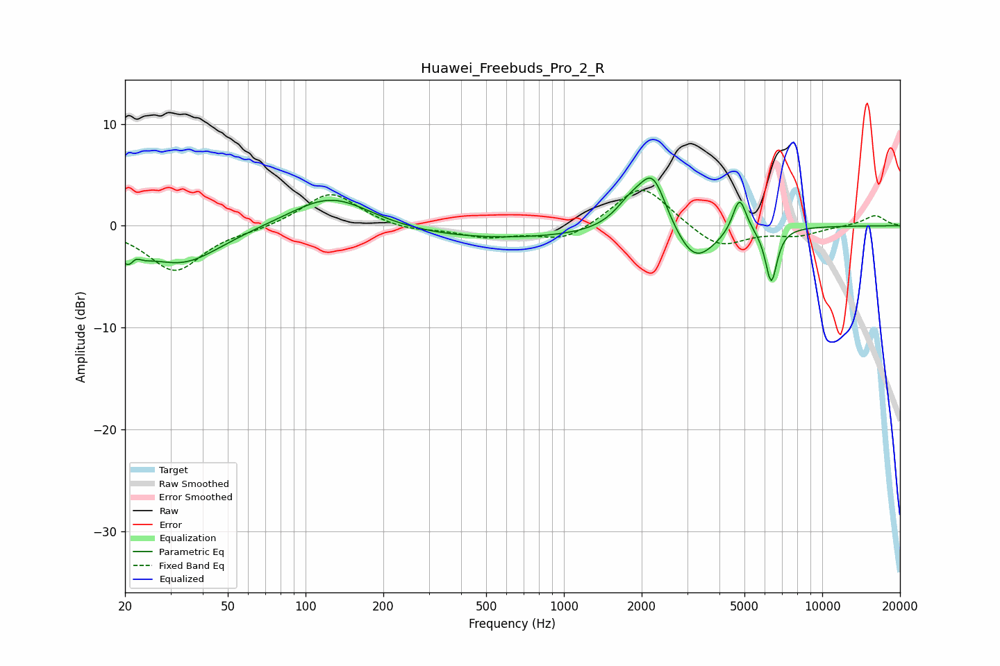

# Huawei_Freebuds_Pro_2_R
See [usage instructions](https://github.com/jaakkopasanen/AutoEq#usage) for more options and info.

### Parametric EQs
Apply preamp of -4.8 dB when using parametric equalizer.

|   # | Type    |   Fc (Hz) |    Q |   Gain (dB) |
|-----|---------|-----------|------|-------------|
|   1 | Peaking |        21 | 3.76 |        -3.4 |
|   2 | Peaking |        22 | 5.97 |         2   |
|   3 | Peaking |        33 | 0.93 |        -3.7 |
|   4 | Peaking |       126 | 0.9  |         3.4 |
|   5 | Peaking |       493 | 0.31 |        -1.4 |
|   6 | Peaking |      1808 | 2.28 |         2.1 |
|   7 | Peaking |      2213 | 2.6  |         5.2 |
|   8 | Peaking |      3210 | 1.77 |        -3.8 |
|   9 | Peaking |      4785 | 5.27 |         3.6 |
|  10 | Peaking |      6349 | 6    |        -5.4 |

### Fixed Band EQs
When using fixed band (also called graphic) equalizer, apply preamp of **-3.6 dB** (if available) and set gains manually with these parameters.

|   # | Type    |   Fc (Hz) |    Q |   Gain (dB) |
|-----|---------|-----------|------|-------------|
|   1 | Peaking |        31 | 1.41 |        -4.4 |
|   2 | Peaking |        62 | 1.41 |        -0.3 |
|   3 | Peaking |       125 | 1.41 |         3.4 |
|   4 | Peaking |       250 | 1.41 |        -0.5 |
|   5 | Peaking |       500 | 1.41 |        -1.1 |
|   6 | Peaking |      1000 | 1.41 |        -1.5 |
|   7 | Peaking |      2000 | 1.41 |         4.2 |
|   8 | Peaking |      4000 | 1.41 |        -2.3 |
|   9 | Peaking |      8000 | 1.41 |        -0.9 |
|  10 | Peaking |     16000 | 1.41 |         1   |

### Graphs

