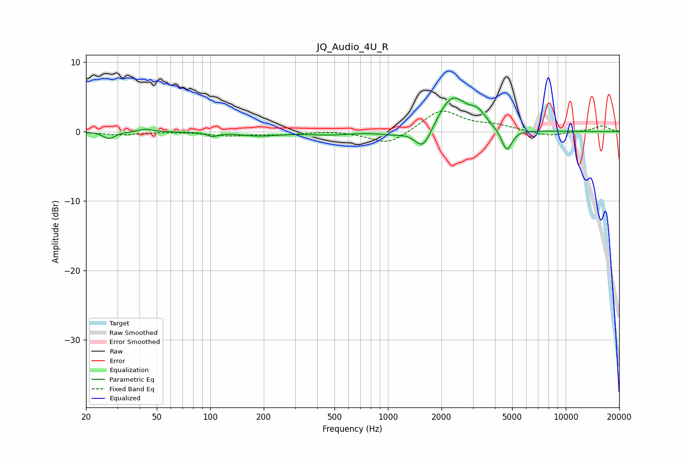

# JQ_Audio_4U_R
See [usage instructions](https://github.com/jaakkopasanen/AutoEq#usage) for more options and info.

### Parametric EQs
Apply preamp of -4.9 dB when using parametric equalizer.

|   # | Type    |   Fc (Hz) |    Q |   Gain (dB) |
|-----|---------|-----------|------|-------------|
|   1 | Peaking |        27 | 4.33 |        -1   |
|   2 | Peaking |        43 | 4.04 |         0.4 |
|   3 | Peaking |       103 | 5.17 |        -0.5 |
|   4 | Peaking |       189 | 1.21 |        -0.6 |
|   5 | Peaking |       473 | 1.21 |        -0.4 |
|   6 | Peaking |      1054 | 1.89 |        -0.5 |
|   7 | Peaking |      1579 | 2.94 |        -3.4 |
|   8 | Peaking |      2303 | 1.74 |         5.1 |
|   9 | Peaking |      3201 | 3.2  |         1.7 |
|  10 | Peaking |      4663 | 4.75 |        -3.3 |

### Fixed Band EQs
When using fixed band (also called graphic) equalizer, apply preamp of **-3.0 dB** (if available) and set gains manually with these parameters.

|   # | Type    |   Fc (Hz) |    Q |   Gain (dB) |
|-----|---------|-----------|------|-------------|
|   1 | Peaking |        31 | 1.41 |        -0.5 |
|   2 | Peaking |        62 | 1.41 |         0   |
|   3 | Peaking |       125 | 1.41 |        -0.6 |
|   4 | Peaking |       250 | 1.41 |        -0.4 |
|   5 | Peaking |       500 | 1.41 |         0.2 |
|   6 | Peaking |      1000 | 1.41 |        -2   |
|   7 | Peaking |      2000 | 1.41 |         3.2 |
|   8 | Peaking |      4000 | 1.41 |         0.8 |
|   9 | Peaking |      8000 | 1.41 |        -0.7 |
|  10 | Peaking |     16000 | 1.41 |         0.8 |

### Graphs

