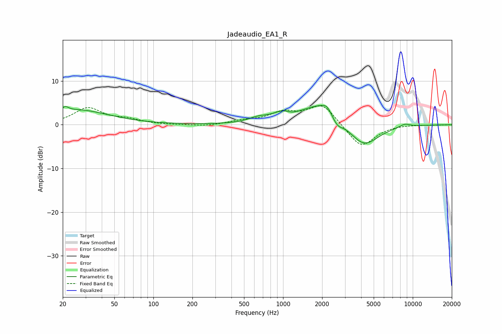

# Jadeaudio_EA1_R
See [usage instructions](https://github.com/jaakkopasanen/AutoEq#usage) for more options and info.

### Parametric EQs
Apply preamp of -4.5 dB when using parametric equalizer.

|   # | Type    |   Fc (Hz) |    Q |   Gain (dB) |
|-----|---------|-----------|------|-------------|
|   1 | Peaking |        21 | 5.64 |         1   |
|   2 | Peaking |        26 | 0.58 |         3.3 |
|   3 | Peaking |       640 | 1.94 |         1   |
|   4 | Peaking |       998 | 1.76 |         1.9 |
|   5 | Peaking |      1162 | 2.97 |        -0.6 |
|   6 | Peaking |      1976 | 0.98 |         4.8 |
|   7 | Peaking |      2175 | 4.12 |         1.3 |
|   8 | Peaking |      2612 | 3.41 |        -2   |
|   9 | Peaking |      4186 | 1.24 |        -5.4 |
|  10 | Peaking |      8687 | 3.18 |         0.7 |

### Fixed Band EQs
When using fixed band (also called graphic) equalizer, apply preamp of **-4.4 dB** (if available) and set gains manually with these parameters.

|   # | Type    |   Fc (Hz) |    Q |   Gain (dB) |
|-----|---------|-----------|------|-------------|
|   1 | Peaking |        31 | 1.41 |         3.7 |
|   2 | Peaking |        62 | 1.41 |         1   |
|   3 | Peaking |       125 | 1.41 |        -0.1 |
|   4 | Peaking |       250 | 1.41 |        -0.4 |
|   5 | Peaking |       500 | 1.41 |         0.8 |
|   6 | Peaking |      1000 | 1.41 |         2.5 |
|   7 | Peaking |      2000 | 1.41 |         4.7 |
|   8 | Peaking |      4000 | 1.41 |        -5.4 |
|   9 | Peaking |      8000 | 1.41 |         0.1 |
|  10 | Peaking |     16000 | 1.41 |        -0.1 |

### Graphs

