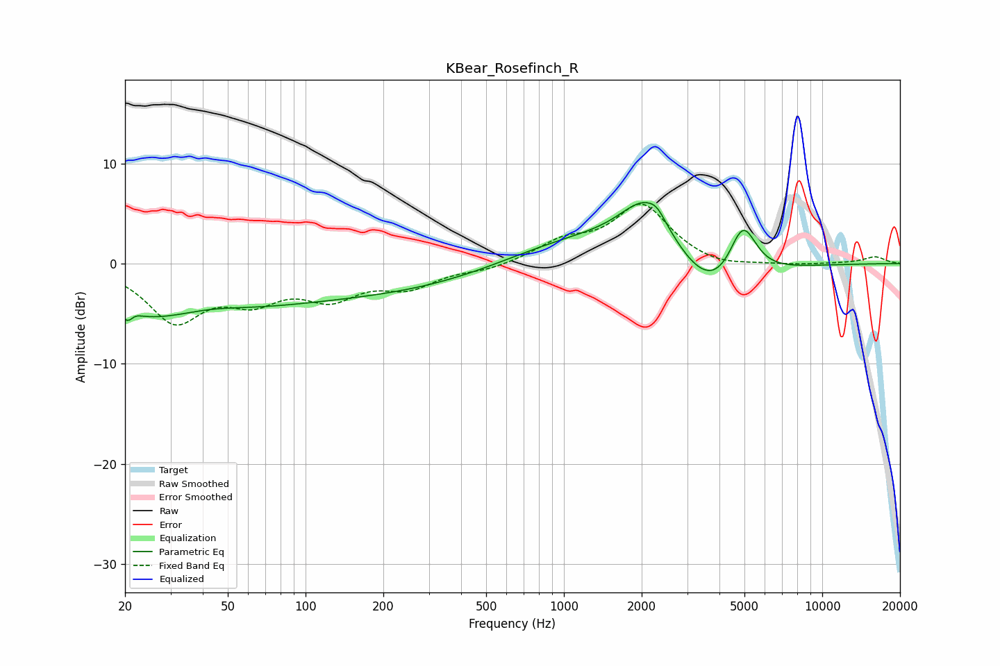

# KBear_Rosefinch_R
See [usage instructions](https://github.com/jaakkopasanen/AutoEq#usage) for more options and info.

### Parametric EQs
Apply preamp of -6.2 dB when using parametric equalizer.

|   # | Type    |   Fc (Hz) |    Q |   Gain (dB) |
|-----|---------|-----------|------|-------------|
|   1 | Peaking |        21 | 5.7  |        -3.8 |
|   2 | Peaking |        21 | 5.5  |         3.3 |
|   3 | Peaking |        26 | 0.46 |        -5.2 |
|   4 | Peaking |        41 | 0.84 |         1.6 |
|   5 | Peaking |       145 | 0.25 |        -3.1 |
|   6 | Peaking |      1068 | 0.52 |         2.5 |
|   7 | Peaking |      2095 | 1.33 |         5.9 |
|   8 | Peaking |      2290 | 4.86 |         0.7 |
|   9 | Peaking |      3794 | 0.97 |        -4.6 |
|  10 | Peaking |      4926 | 2.56 |         5.7 |

### Fixed Band EQs
When using fixed band (also called graphic) equalizer, apply preamp of **-6.0 dB** (if available) and set gains manually with these parameters.

|   # | Type    |   Fc (Hz) |    Q |   Gain (dB) |
|-----|---------|-----------|------|-------------|
|   1 | Peaking |        31 | 1.41 |        -5.5 |
|   2 | Peaking |        62 | 1.41 |        -3   |
|   3 | Peaking |       125 | 1.41 |        -3   |
|   4 | Peaking |       250 | 1.41 |        -2.1 |
|   5 | Peaking |       500 | 1.41 |        -0.6 |
|   6 | Peaking |      1000 | 1.41 |         1.9 |
|   7 | Peaking |      2000 | 1.41 |         5.7 |
|   8 | Peaking |      4000 | 1.41 |        -0.6 |
|   9 | Peaking |      8000 | 1.41 |        -0.2 |
|  10 | Peaking |     16000 | 1.41 |         0.7 |

### Graphs

