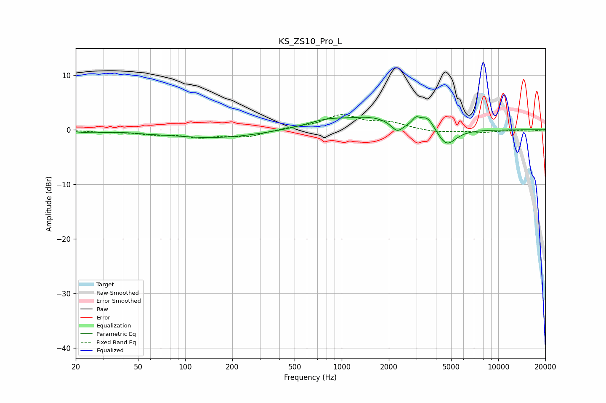

# KS_ZS10_Pro_L
See [usage instructions](https://github.com/jaakkopasanen/AutoEq#usage) for more options and info.

### Parametric EQs
Apply preamp of -2.5 dB when using parametric equalizer.

|   # | Type    |   Fc (Hz) |    Q |   Gain (dB) |
|-----|---------|-----------|------|-------------|
|   1 | Peaking |        24 | 1.56 |        -0.4 |
|   2 | Peaking |        59 | 2.55 |        -0.1 |
|   3 | Peaking |       153 | 0.47 |        -1.5 |
|   4 | Peaking |       457 | 0.99 |         0.1 |
|   5 | Peaking |       791 | 1.13 |         1.3 |
|   6 | Peaking |      1564 | 0.84 |         2.1 |
|   7 | Peaking |      2261 | 3.68 |        -1.8 |
|   8 | Peaking |      2981 | 5.98 |         1.2 |
|   9 | Peaking |      3533 | 3.09 |         2.4 |
|  10 | Peaking |      4664 | 2.31 |        -3.3 |

### Fixed Band EQs
When using fixed band (also called graphic) equalizer, apply preamp of **-2.9 dB** (if available) and set gains manually with these parameters.

|   # | Type    |   Fc (Hz) |    Q |   Gain (dB) |
|-----|---------|-----------|------|-------------|
|   1 | Peaking |        31 | 1.41 |        -0.3 |
|   2 | Peaking |        62 | 1.41 |        -0.7 |
|   3 | Peaking |       125 | 1.41 |        -1.2 |
|   4 | Peaking |       250 | 1.41 |        -1.2 |
|   5 | Peaking |       500 | 1.41 |         0.3 |
|   6 | Peaking |      1000 | 1.41 |         2.6 |
|   7 | Peaking |      2000 | 1.41 |         1.2 |
|   8 | Peaking |      4000 | 1.41 |        -0.5 |
|   9 | Peaking |      8000 | 1.41 |        -0.4 |
|  10 | Peaking |     16000 | 1.41 |        -0.2 |

### Graphs

