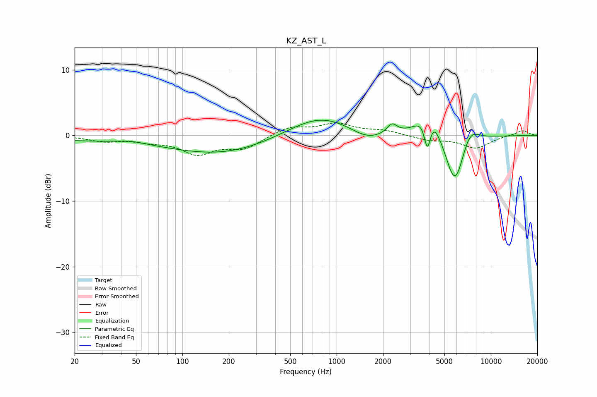

# KZ_AST_L
See [usage instructions](https://github.com/jaakkopasanen/AutoEq#usage) for more options and info.

### Parametric EQs
Apply preamp of -2.4 dB when using parametric equalizer.

|   # | Type    |   Fc (Hz) |    Q |   Gain (dB) |
|-----|---------|-----------|------|-------------|
|   1 | Peaking |        44 | 0.18 |        -0.8 |
|   2 | Peaking |        47 | 1.47 |         0.4 |
|   3 | Peaking |       191 | 0.44 |        -2.3 |
|   4 | Peaking |       782 | 0.67 |         3.3 |
|   5 | Peaking |      1576 | 1.31 |        -1.6 |
|   6 | Peaking |      2286 | 4.33 |         1.5 |
|   7 | Peaking |      3879 | 5.91 |        -6.3 |
|   8 | Peaking |      3960 | 2.28 |         6.1 |
|   9 | Peaking |      5856 | 2.15 |        -8.6 |
|  10 | Peaking |      7259 | 2.27 |         3   |

### Fixed Band EQs
When using fixed band (also called graphic) equalizer, apply preamp of **-2.0 dB** (if available) and set gains manually with these parameters.

|   # | Type    |   Fc (Hz) |    Q |   Gain (dB) |
|-----|---------|-----------|------|-------------|
|   1 | Peaking |        31 | 1.41 |        -0.8 |
|   2 | Peaking |        62 | 1.41 |        -0.7 |
|   3 | Peaking |       125 | 1.41 |        -2.6 |
|   4 | Peaking |       250 | 1.41 |        -1.9 |
|   5 | Peaking |       500 | 1.41 |         1.3 |
|   6 | Peaking |      1000 | 1.41 |         1.7 |
|   7 | Peaking |      2000 | 1.41 |         0.7 |
|   8 | Peaking |      4000 | 1.41 |        -0.7 |
|   9 | Peaking |      8000 | 1.41 |        -1.9 |
|  10 | Peaking |     16000 | 1.41 |         0.8 |

### Graphs

