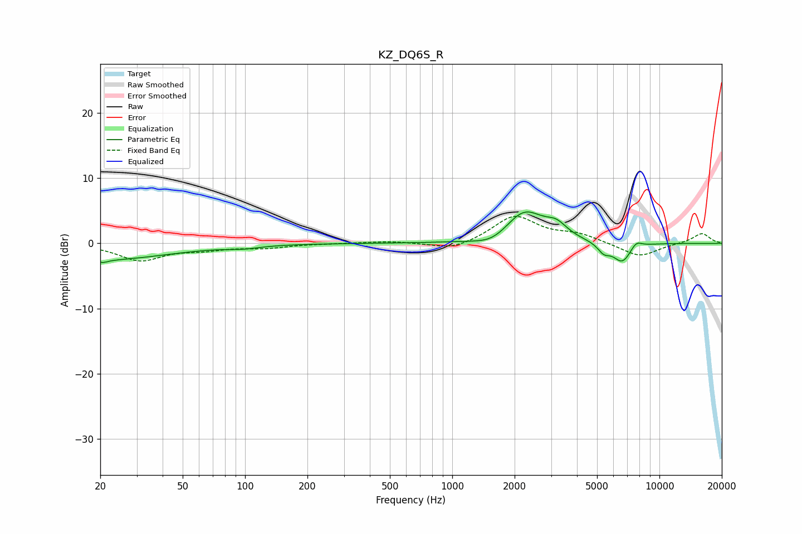

# KZ_DQ6S_R
See [usage instructions](https://github.com/jaakkopasanen/AutoEq#usage) for more options and info.

### Parametric EQs
Apply preamp of -4.9 dB when using parametric equalizer.

|   # | Type    |   Fc (Hz) |    Q |   Gain (dB) |
|-----|---------|-----------|------|-------------|
|   1 | Peaking |        20 | 0.43 |        -2.5 |
|   2 | Peaking |        20 | 5.95 |         1.5 |
|   3 | Peaking |        20 | 5.72 |        -1.9 |
|   4 | Peaking |        98 | 1.79 |        -0.4 |
|   5 | Peaking |      1574 | 1.67 |        -1.4 |
|   6 | Peaking |      2223 | 1.49 |         5   |
|   7 | Peaking |      3186 | 2.73 |         1.8 |
|   8 | Peaking |      5390 | 4.7  |        -1.4 |
|   9 | Peaking |      6613 | 3.03 |        -3   |
|  10 | Peaking |      7714 | 4.88 |         1.1 |

### Fixed Band EQs
When using fixed band (also called graphic) equalizer, apply preamp of **-4.2 dB** (if available) and set gains manually with these parameters.

|   # | Type    |   Fc (Hz) |    Q |   Gain (dB) |
|-----|---------|-----------|------|-------------|
|   1 | Peaking |        31 | 1.41 |        -2.5 |
|   2 | Peaking |        62 | 1.41 |        -0.8 |
|   3 | Peaking |       125 | 1.41 |        -0.6 |
|   4 | Peaking |       250 | 1.41 |        -0   |
|   5 | Peaking |       500 | 1.41 |         0.3 |
|   6 | Peaking |      1000 | 1.41 |        -1.2 |
|   7 | Peaking |      2000 | 1.41 |         4.2 |
|   8 | Peaking |      4000 | 1.41 |         1.3 |
|   9 | Peaking |      8000 | 1.41 |        -2.1 |
|  10 | Peaking |     16000 | 1.41 |         1.6 |

### Graphs

