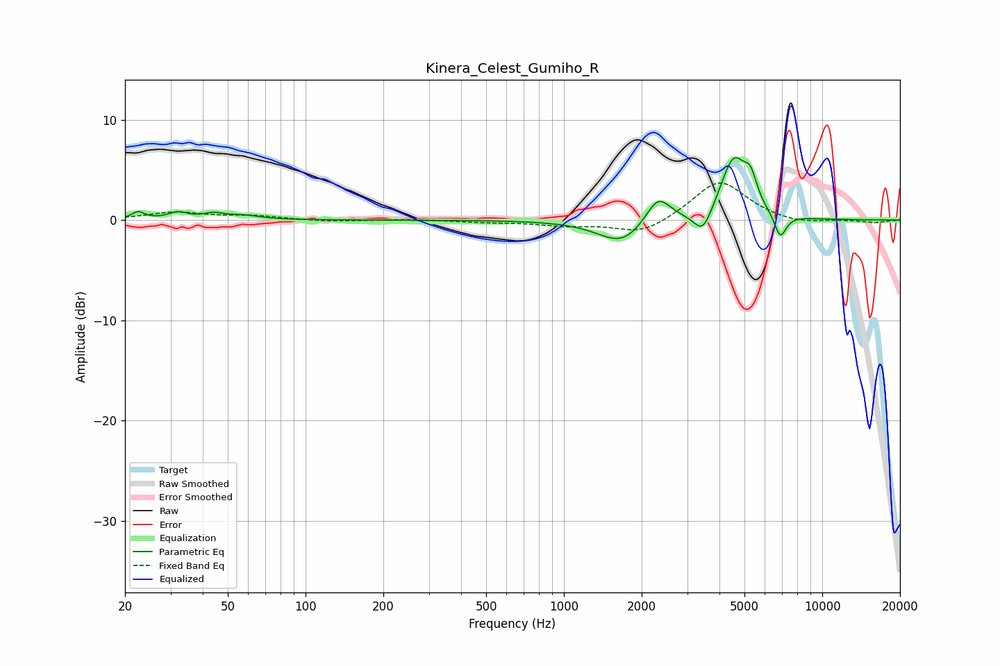

# Kinera_Celest_Gumiho_R
See [usage instructions](https://github.com/jaakkopasanen/AutoEq#usage) for more options and info.

### Parametric EQs
Apply preamp of -6.3 dB when using parametric equalizer.

|   # | Type    |   Fc (Hz) |    Q |   Gain (dB) |
|-----|---------|-----------|------|-------------|
|   1 | Peaking |        22 | 5.84 |         0.7 |
|   2 | Peaking |        32 | 3.78 |         0.7 |
|   3 | Peaking |        44 | 3.75 |         0.5 |
|   4 | Peaking |        57 | 2.16 |         0.4 |
|   5 | Peaking |      1677 | 1.54 |        -2.5 |
|   6 | Peaking |      2313 | 2.91 |         2.8 |
|   7 | Peaking |      3454 | 3.94 |        -2.4 |
|   8 | Peaking |      4544 | 2.67 |         6.1 |
|   9 | Peaking |      5283 | 5.75 |         2.3 |
|  10 | Peaking |      6881 | 5.87 |        -2.4 |

### Fixed Band EQs
When using fixed band (also called graphic) equalizer, apply preamp of **-3.8 dB** (if available) and set gains manually with these parameters.

|   # | Type    |   Fc (Hz) |    Q |   Gain (dB) |
|-----|---------|-----------|------|-------------|
|   1 | Peaking |        31 | 1.41 |         0.7 |
|   2 | Peaking |        62 | 1.41 |         0.4 |
|   3 | Peaking |       125 | 1.41 |        -0.2 |
|   4 | Peaking |       250 | 1.41 |         0.1 |
|   5 | Peaking |       500 | 1.41 |        -0.2 |
|   6 | Peaking |      1000 | 1.41 |        -0.5 |
|   7 | Peaking |      2000 | 1.41 |        -1.5 |
|   8 | Peaking |      4000 | 1.41 |         4   |
|   9 | Peaking |      8000 | 1.41 |        -0.5 |
|  10 | Peaking |     16000 | 1.41 |        -0.3 |

### Graphs

