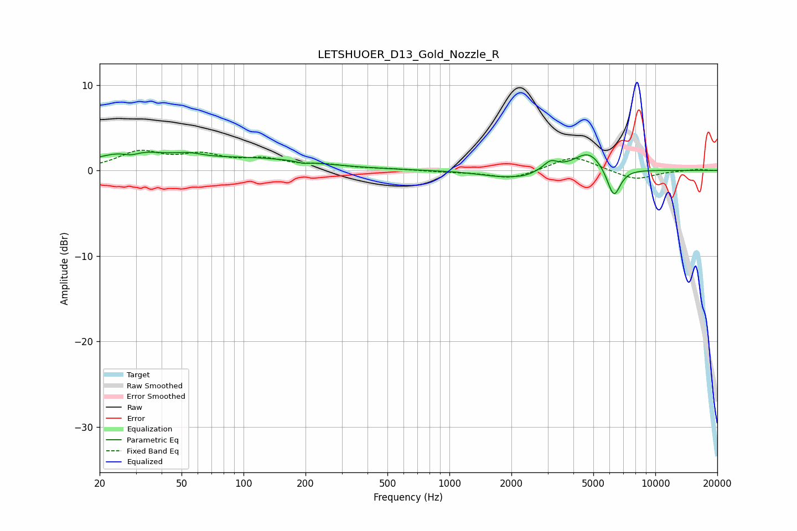

# LETSHUOER_D13_Gold_Nozzle_R
See [usage instructions](https://github.com/jaakkopasanen/AutoEq#usage) for more options and info.

### Parametric EQs
Apply preamp of -2.2 dB when using parametric equalizer.

|   # | Type    |   Fc (Hz) |    Q |   Gain (dB) |
|-----|---------|-----------|------|-------------|
|   1 | Peaking |        28 | 0.91 |         2.1 |
|   2 | Peaking |        28 | 3.34 |        -0.6 |
|   3 | Peaking |        54 | 2.08 |         0.5 |
|   4 | Peaking |       112 | 0.47 |         1.3 |
|   5 | Peaking |       195 | 5.37 |        -0.2 |
|   6 | Peaking |      1837 | 1.18 |        -0.8 |
|   7 | Peaking |      2331 | 2.74 |        -0.3 |
|   8 | Peaking |      3100 | 4.12 |         1   |
|   9 | Peaking |      4743 | 1.97 |         2.3 |
|  10 | Peaking |      6284 | 4.18 |        -3.6 |

### Fixed Band EQs
When using fixed band (also called graphic) equalizer, apply preamp of **-2.5 dB** (if available) and set gains manually with these parameters.

|   # | Type    |   Fc (Hz) |    Q |   Gain (dB) |
|-----|---------|-----------|------|-------------|
|   1 | Peaking |        31 | 1.41 |         2   |
|   2 | Peaking |        62 | 1.41 |         1.5 |
|   3 | Peaking |       125 | 1.41 |         1.1 |
|   4 | Peaking |       250 | 1.41 |         0.5 |
|   5 | Peaking |       500 | 1.41 |         0.1 |
|   6 | Peaking |      1000 | 1.41 |        -0.2 |
|   7 | Peaking |      2000 | 1.41 |        -1   |
|   8 | Peaking |      4000 | 1.41 |         1.7 |
|   9 | Peaking |      8000 | 1.41 |        -1.1 |
|  10 | Peaking |     16000 | 1.41 |         0.2 |

### Graphs

