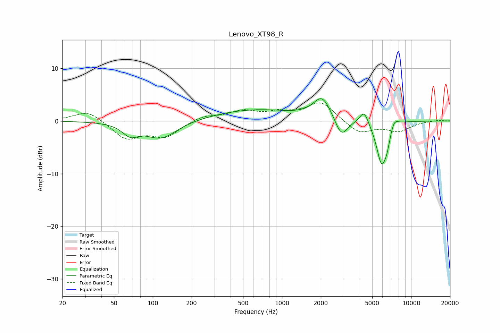

# Lenovo_XT98_R
See [usage instructions](https://github.com/jaakkopasanen/AutoEq#usage) for more options and info.

### Parametric EQs
Apply preamp of -4.3 dB when using parametric equalizer.

|   # | Type    |   Fc (Hz) |    Q |   Gain (dB) |
|-----|---------|-----------|------|-------------|
|   1 | Peaking |        67 | 2.32 |        -2.1 |
|   2 | Peaking |       116 | 1.17 |        -3.3 |
|   3 | Peaking |       611 | 0.44 |         2.1 |
|   4 | Peaking |      2048 | 2.09 |         4.2 |
|   5 | Peaking |      2883 | 2.86 |        -3.7 |
|   6 | Peaking |      4328 | 4.13 |         2.6 |
|   7 | Peaking |      5913 | 3.34 |        -8.1 |
|   8 | Peaking |      6504 | 6    |        -1.8 |
|   9 | Peaking |      7372 | 5.18 |         1.5 |
|  10 | Peaking |      8274 | 2.6  |         0.6 |

### Fixed Band EQs
When using fixed band (also called graphic) equalizer, apply preamp of **-3.5 dB** (if available) and set gains manually with these parameters.

|   # | Type    |   Fc (Hz) |    Q |   Gain (dB) |
|-----|---------|-----------|------|-------------|
|   1 | Peaking |        31 | 1.41 |         2.1 |
|   2 | Peaking |        62 | 1.41 |        -3.3 |
|   3 | Peaking |       125 | 1.41 |        -2.9 |
|   4 | Peaking |       250 | 1.41 |         1   |
|   5 | Peaking |       500 | 1.41 |         1.7 |
|   6 | Peaking |      1000 | 1.41 |         1.4 |
|   7 | Peaking |      2000 | 1.41 |         3.6 |
|   8 | Peaking |      4000 | 1.41 |        -2.4 |
|   9 | Peaking |      8000 | 1.41 |        -1.8 |
|  10 | Peaking |     16000 | 1.41 |         0.2 |

### Graphs

