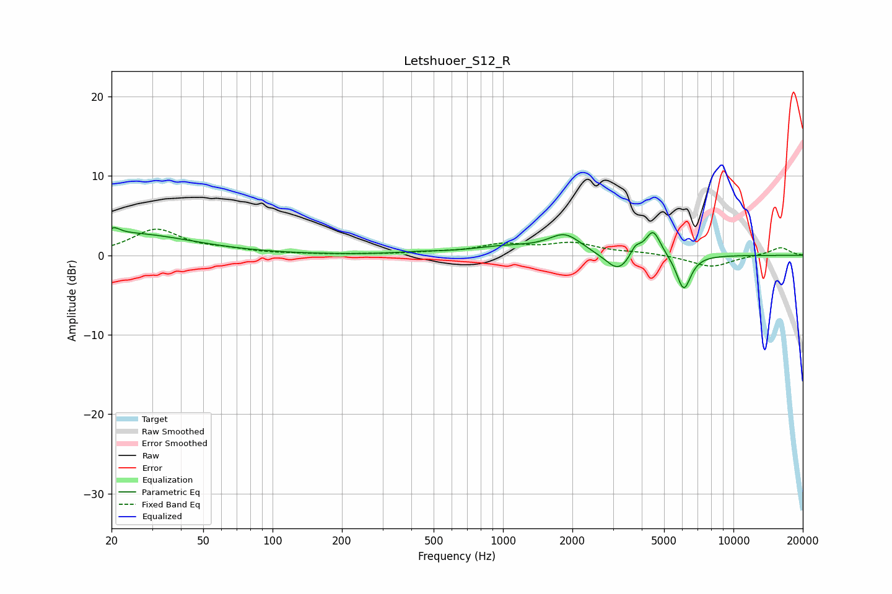

# Letshuoer_S12_R
See [usage instructions](https://github.com/jaakkopasanen/AutoEq#usage) for more options and info.

### Parametric EQs
Apply preamp of -3.6 dB when using parametric equalizer.

|   # | Type    |   Fc (Hz) |    Q |   Gain (dB) |
|-----|---------|-----------|------|-------------|
|   1 | Peaking |        21 | 5.74 |         0.7 |
|   2 | Peaking |        23 | 0.5  |         2.7 |
|   3 | Peaking |       433 | 1.46 |         0.2 |
|   4 | Peaking |      1042 | 0.9  |         1   |
|   5 | Peaking |      1859 | 2    |         2.3 |
|   6 | Peaking |      3163 | 2.63 |        -2.4 |
|   7 | Peaking |      3754 | 6    |         1.3 |
|   8 | Peaking |      4269 | 6    |        -0.1 |
|   9 | Peaking |      4474 | 4.14 |         3.4 |
|  10 | Peaking |      6086 | 4.45 |        -4.5 |

### Fixed Band EQs
When using fixed band (also called graphic) equalizer, apply preamp of **-3.4 dB** (if available) and set gains manually with these parameters.

|   # | Type    |   Fc (Hz) |    Q |   Gain (dB) |
|-----|---------|-----------|------|-------------|
|   1 | Peaking |        31 | 1.41 |         3.2 |
|   2 | Peaking |        62 | 1.41 |         0.5 |
|   3 | Peaking |       125 | 1.41 |         0.1 |
|   4 | Peaking |       250 | 1.41 |         0.1 |
|   5 | Peaking |       500 | 1.41 |         0.2 |
|   6 | Peaking |      1000 | 1.41 |         1.2 |
|   7 | Peaking |      2000 | 1.41 |         1.4 |
|   8 | Peaking |      4000 | 1.41 |         0.3 |
|   9 | Peaking |      8000 | 1.41 |        -1.5 |
|  10 | Peaking |     16000 | 1.41 |         1   |

### Graphs

