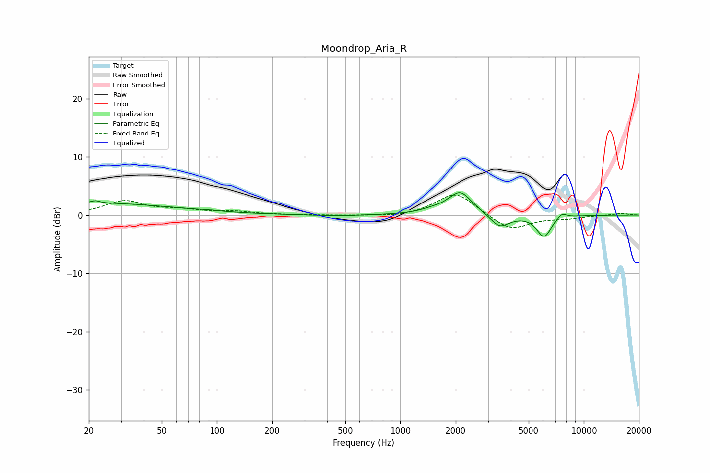

# Moondrop_Aria_R
See [usage instructions](https://github.com/jaakkopasanen/AutoEq#usage) for more options and info.

### Parametric EQs
Apply preamp of -4.0 dB when using parametric equalizer.

|   # | Type    |   Fc (Hz) |    Q |   Gain (dB) |
|-----|---------|-----------|------|-------------|
|   1 | Peaking |        21 | 5.99 |        -1.4 |
|   2 | Peaking |        21 | 5.83 |         1.8 |
|   3 | Peaking |        22 | 0.31 |         2   |
|   4 | Peaking |        92 | 2.53 |         0.1 |
|   5 | Peaking |       451 | 1.44 |        -0.2 |
|   6 | Peaking |      1491 | 1.98 |         0.5 |
|   7 | Peaking |      2119 | 2.17 |         4   |
|   8 | Peaking |      3482 | 2.69 |        -2.3 |
|   9 | Peaking |      6078 | 3.45 |        -3.7 |
|  10 | Peaking |      7564 | 5.11 |         1   |

### Fixed Band EQs
When using fixed band (also called graphic) equalizer, apply preamp of **-3.6 dB** (if available) and set gains manually with these parameters.

|   # | Type    |   Fc (Hz) |    Q |   Gain (dB) |
|-----|---------|-----------|------|-------------|
|   1 | Peaking |        31 | 1.41 |         2.4 |
|   2 | Peaking |        62 | 1.41 |         0.7 |
|   3 | Peaking |       125 | 1.41 |         0.5 |
|   4 | Peaking |       250 | 1.41 |         0   |
|   5 | Peaking |       500 | 1.41 |        -0.1 |
|   6 | Peaking |      1000 | 1.41 |        -0.4 |
|   7 | Peaking |      2000 | 1.41 |         4   |
|   8 | Peaking |      4000 | 1.41 |        -2.7 |
|   9 | Peaking |      8000 | 1.41 |        -0.5 |
|  10 | Peaking |     16000 | 1.41 |         0.3 |

### Graphs

