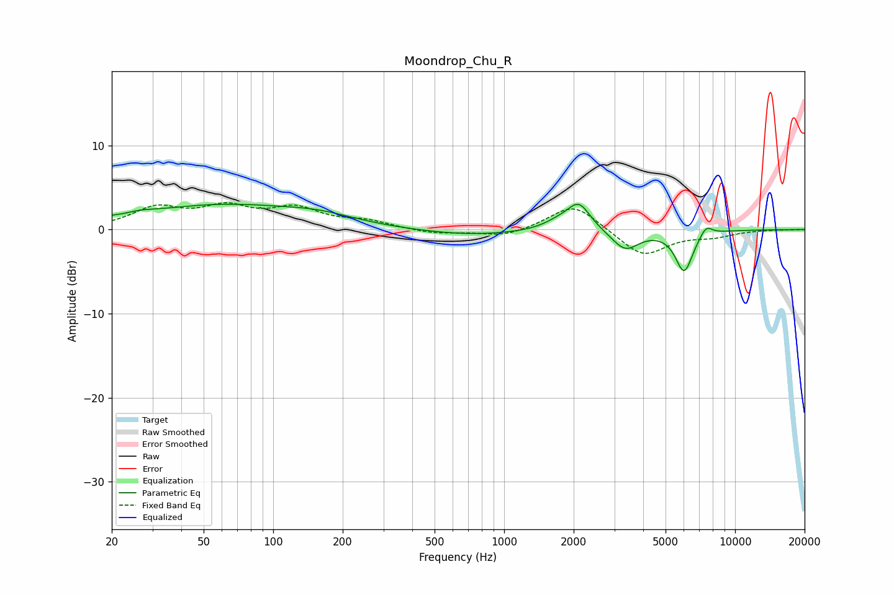

# Moondrop_Chu_R
See [usage instructions](https://github.com/jaakkopasanen/AutoEq#usage) for more options and info.

### Parametric EQs
Apply preamp of -3.1 dB when using parametric equalizer.

|   # | Type    |   Fc (Hz) |    Q |   Gain (dB) |
|-----|---------|-----------|------|-------------|
|   1 | Peaking |        20 | 5.91 |         0.2 |
|   2 | Peaking |        26 | 2.1  |         0.4 |
|   3 | Peaking |        59 | 0.41 |         2.8 |
|   4 | Peaking |       159 | 0.9  |         0.9 |
|   5 | Peaking |       711 | 0.63 |        -0.7 |
|   6 | Peaking |      1717 | 2.11 |         0.8 |
|   7 | Peaking |      2107 | 2.83 |         3.1 |
|   8 | Peaking |      3344 | 2.42 |        -2.4 |
|   9 | Peaking |      6020 | 3.65 |        -4.9 |
|  10 | Peaking |      7495 | 4.99 |         1.2 |

### Fixed Band EQs
When using fixed band (also called graphic) equalizer, apply preamp of **-3.3 dB** (if available) and set gains manually with these parameters.

|   # | Type    |   Fc (Hz) |    Q |   Gain (dB) |
|-----|---------|-----------|------|-------------|
|   1 | Peaking |        31 | 1.41 |         2.4 |
|   2 | Peaking |        62 | 1.41 |         2.3 |
|   3 | Peaking |       125 | 1.41 |         2.2 |
|   4 | Peaking |       250 | 1.41 |         0.9 |
|   5 | Peaking |       500 | 1.41 |        -0.5 |
|   6 | Peaking |      1000 | 1.41 |        -0.9 |
|   7 | Peaking |      2000 | 1.41 |         3.2 |
|   8 | Peaking |      4000 | 1.41 |        -3.2 |
|   9 | Peaking |      8000 | 1.41 |        -0.7 |
|  10 | Peaking |     16000 | 1.41 |         0   |

### Graphs

