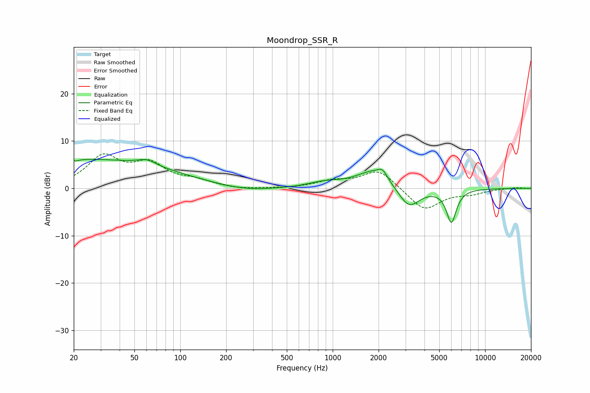

# Moondrop_SSR_R
See [usage instructions](https://github.com/jaakkopasanen/AutoEq#usage) for more options and info.

### Parametric EQs
Apply preamp of -6.2 dB when using parametric equalizer.

|   # | Type    |   Fc (Hz) |    Q |   Gain (dB) |
|-----|---------|-----------|------|-------------|
|   1 | Peaking |        20 | 5.88 |         3.3 |
|   2 | Peaking |        20 | 5.9  |        -3.7 |
|   3 | Peaking |        22 | 0.21 |         6.1 |
|   4 | Peaking |        60 | 2.29 |         1.2 |
|   5 | Peaking |       267 | 0.77 |        -0.9 |
|   6 | Peaking |       884 | 1.29 |         1.1 |
|   7 | Peaking |      1857 | 1.25 |         3.8 |
|   8 | Peaking |      2124 | 4.74 |         1.6 |
|   9 | Peaking |      3159 | 1.99 |        -4.6 |
|  10 | Peaking |      6008 | 4.26 |        -7   |

### Fixed Band EQs
When using fixed band (also called graphic) equalizer, apply preamp of **-7.4 dB** (if available) and set gains manually with these parameters.

|   # | Type    |   Fc (Hz) |    Q |   Gain (dB) |
|-----|---------|-----------|------|-------------|
|   1 | Peaking |        31 | 1.41 |         6.4 |
|   2 | Peaking |        62 | 1.41 |         4.6 |
|   3 | Peaking |       125 | 1.41 |         1.3 |
|   4 | Peaking |       250 | 1.41 |        -0.3 |
|   5 | Peaking |       500 | 1.41 |        -0   |
|   6 | Peaking |      1000 | 1.41 |         1.4 |
|   7 | Peaking |      2000 | 1.41 |         4   |
|   8 | Peaking |      4000 | 1.41 |        -4.7 |
|   9 | Peaking |      8000 | 1.41 |        -1   |
|  10 | Peaking |     16000 | 1.41 |         0.2 |

### Graphs

