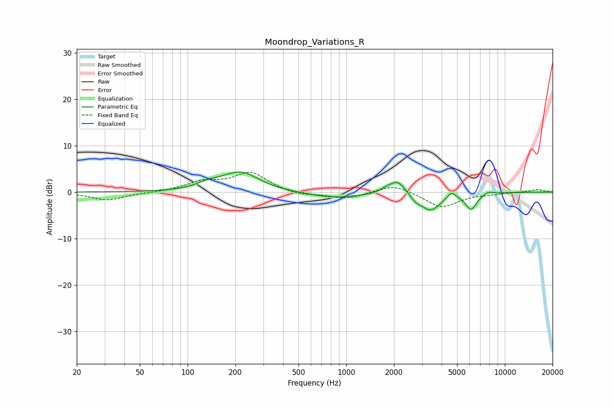

# Moondrop_Variations_R
See [usage instructions](https://github.com/jaakkopasanen/AutoEq#usage) for more options and info.

### Parametric EQs
Apply preamp of -4.4 dB when using parametric equalizer.

|   # | Type    |   Fc (Hz) |    Q |   Gain (dB) |
|-----|---------|-----------|------|-------------|
|   1 | Peaking |       135 | 1.99 |         1.1 |
|   2 | Peaking |       215 | 1.22 |         4.2 |
|   3 | Peaking |       847 | 0.83 |        -1.3 |
|   4 | Peaking |      1777 | 3.92 |         0.6 |
|   5 | Peaking |      2106 | 2.81 |         2.9 |
|   6 | Peaking |      2741 | 4.11 |        -1.2 |
|   7 | Peaking |      3404 | 2.31 |        -3.8 |
|   8 | Peaking |      4606 | 5.85 |         1.4 |
|   9 | Peaking |      6125 | 3.87 |        -3.5 |
|  10 | Peaking |      7895 | 4.57 |         0.6 |

### Fixed Band EQs
When using fixed band (also called graphic) equalizer, apply preamp of **-4.3 dB** (if available) and set gains manually with these parameters.

|   # | Type    |   Fc (Hz) |    Q |   Gain (dB) |
|-----|---------|-----------|------|-------------|
|   1 | Peaking |        31 | 1.41 |        -1.7 |
|   2 | Peaking |        62 | 1.41 |        -0.1 |
|   3 | Peaking |       125 | 1.41 |         2   |
|   4 | Peaking |       250 | 1.41 |         4.1 |
|   5 | Peaking |       500 | 1.41 |        -0.8 |
|   6 | Peaking |      1000 | 1.41 |        -1.5 |
|   7 | Peaking |      2000 | 1.41 |         1.8 |
|   8 | Peaking |      4000 | 1.41 |        -3.3 |
|   9 | Peaking |      8000 | 1.41 |        -0.3 |
|  10 | Peaking |     16000 | 1.41 |         0.6 |

### Graphs

