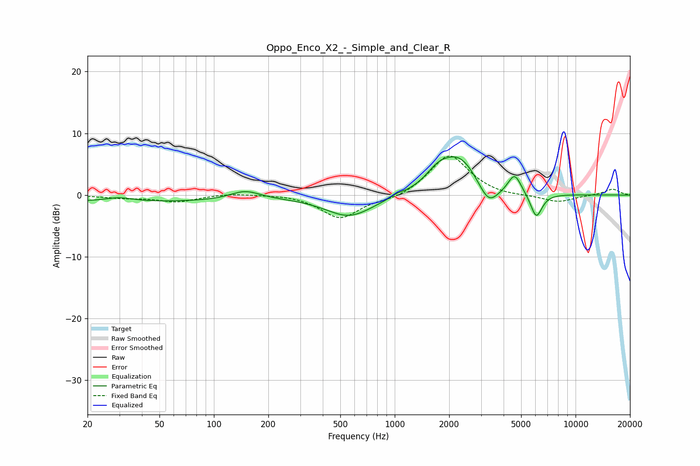

# Oppo_Enco_X2_-_Simple_and_Clear_R
See [usage instructions](https://github.com/jaakkopasanen/AutoEq#usage) for more options and info.

### Parametric EQs
Apply preamp of -6.3 dB when using parametric equalizer.

|   # | Type    |   Fc (Hz) |    Q |   Gain (dB) |
|-----|---------|-----------|------|-------------|
|   1 | Peaking |        30 | 1.86 |         0.7 |
|   2 | Peaking |        34 | 0.2  |        -1.1 |
|   3 | Peaking |       149 | 1.74 |         1.4 |
|   4 | Peaking |       562 | 1.06 |        -3.5 |
|   5 | Peaking |      1028 | 4.59 |         0.3 |
|   6 | Peaking |      1738 | 2.02 |         2.4 |
|   7 | Peaking |      2293 | 1.38 |         5.8 |
|   8 | Peaking |      3302 | 2.55 |        -3.5 |
|   9 | Peaking |      4603 | 3.83 |         3.2 |
|  10 | Peaking |      6065 | 4.3  |        -4   |

### Fixed Band EQs
When using fixed band (also called graphic) equalizer, apply preamp of **-6.4 dB** (if available) and set gains manually with these parameters.

|   # | Type    |   Fc (Hz) |    Q |   Gain (dB) |
|-----|---------|-----------|------|-------------|
|   1 | Peaking |        31 | 1.41 |        -0.4 |
|   2 | Peaking |        62 | 1.41 |        -1.1 |
|   3 | Peaking |       125 | 1.41 |         0.3 |
|   4 | Peaking |       250 | 1.41 |         0.2 |
|   5 | Peaking |       500 | 1.41 |        -3.8 |
|   6 | Peaking |      1000 | 1.41 |        -0.8 |
|   7 | Peaking |      2000 | 1.41 |         6.7 |
|   8 | Peaking |      4000 | 1.41 |        -0.3 |
|   9 | Peaking |      8000 | 1.41 |        -1.2 |
|  10 | Peaking |     16000 | 1.41 |         1   |

### Graphs

