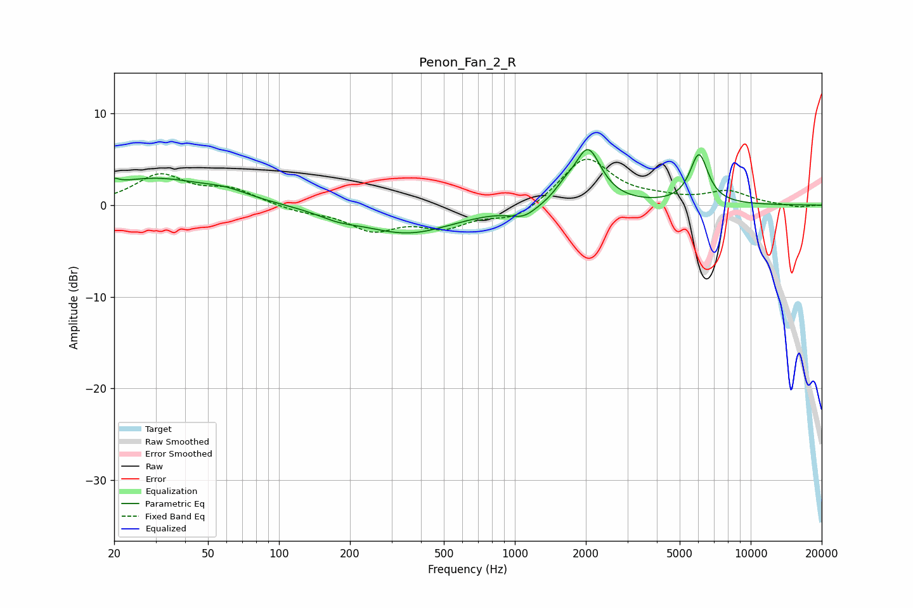

# Penon_Fan_2_R
See [usage instructions](https://github.com/jaakkopasanen/AutoEq#usage) for more options and info.

### Parametric EQs
Apply preamp of -6.1 dB when using parametric equalizer.

|   # | Type    |   Fc (Hz) |    Q |   Gain (dB) |
|-----|---------|-----------|------|-------------|
|   1 | Peaking |        20 | 5.95 |         2.8 |
|   2 | Peaking |        20 | 6    |        -2.1 |
|   3 | Peaking |        29 | 0.64 |         2.8 |
|   4 | Peaking |        60 | 1.46 |         0.7 |
|   5 | Peaking |       177 | 1.65 |        -0.7 |
|   6 | Peaking |       352 | 0.71 |        -3   |
|   7 | Peaking |      1090 | 2.43 |        -1.2 |
|   8 | Peaking |      1623 | 3.37 |         1   |
|   9 | Peaking |      2041 | 2.51 |         6   |
|  10 | Peaking |      6036 | 3.6  |         5.4 |

### Fixed Band EQs
When using fixed band (also called graphic) equalizer, apply preamp of **-5.1 dB** (if available) and set gains manually with these parameters.

|   # | Type    |   Fc (Hz) |    Q |   Gain (dB) |
|-----|---------|-----------|------|-------------|
|   1 | Peaking |        31 | 1.41 |         3.2 |
|   2 | Peaking |        62 | 1.41 |         1.6 |
|   3 | Peaking |       125 | 1.41 |        -0.6 |
|   4 | Peaking |       250 | 1.41 |        -2.5 |
|   5 | Peaking |       500 | 1.41 |        -2.1 |
|   6 | Peaking |      1000 | 1.41 |        -1.6 |
|   7 | Peaking |      2000 | 1.41 |         5.3 |
|   8 | Peaking |      4000 | 1.41 |         0.5 |
|   9 | Peaking |      8000 | 1.41 |         1.4 |
|  10 | Peaking |     16000 | 1.41 |        -0.3 |

### Graphs

