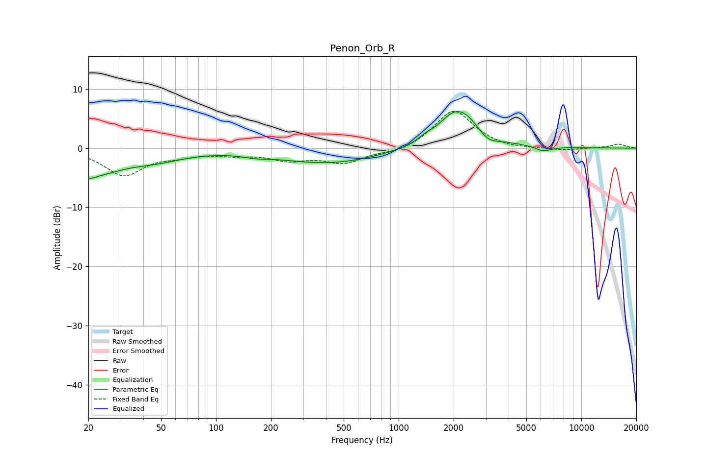

# Penon_Orb_R
See [usage instructions](https://github.com/jaakkopasanen/AutoEq#usage) for more options and info.

### Parametric EQs
Apply preamp of -6.3 dB when using parametric equalizer.

|   # | Type    |   Fc (Hz) |    Q |   Gain (dB) |
|-----|---------|-----------|------|-------------|
|   1 | Peaking |        20 | 4.95 |        -0.8 |
|   2 | Peaking |        21 | 0.96 |        -3.9 |
|   3 | Peaking |        47 | 0.9  |        -1.6 |
|   4 | Peaking |       165 | 2.15 |        -0.4 |
|   5 | Peaking |       416 | 0.5  |        -2.5 |
|   6 | Peaking |      1408 | 3.36 |         0.7 |
|   7 | Peaking |      1935 | 2.1  |         1.5 |
|   8 | Peaking |      2252 | 1.25 |         5.8 |
|   9 | Peaking |      3054 | 2.32 |        -1.9 |
|  10 | Peaking |      6195 | 3.21 |        -0.9 |

### Fixed Band EQs
When using fixed band (also called graphic) equalizer, apply preamp of **-6.3 dB** (if available) and set gains manually with these parameters.

|   # | Type    |   Fc (Hz) |    Q |   Gain (dB) |
|-----|---------|-----------|------|-------------|
|   1 | Peaking |        31 | 1.41 |        -4.5 |
|   2 | Peaking |        62 | 1.41 |        -0.9 |
|   3 | Peaking |       125 | 1.41 |        -0.8 |
|   4 | Peaking |       250 | 1.41 |        -1.7 |
|   5 | Peaking |       500 | 1.41 |        -2.3 |
|   6 | Peaking |      1000 | 1.41 |        -0.9 |
|   7 | Peaking |      2000 | 1.41 |         6.5 |
|   8 | Peaking |      4000 | 1.41 |        -0.3 |
|   9 | Peaking |      8000 | 1.41 |        -0.4 |
|  10 | Peaking |     16000 | 1.41 |         0.7 |

### Graphs

