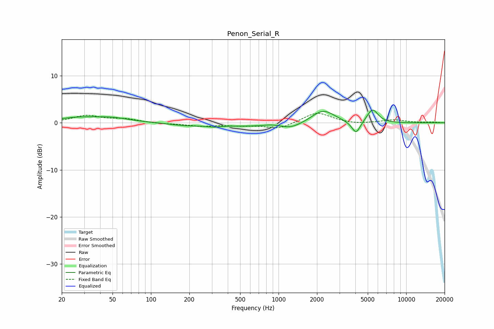

# Penon_Serial_R
See [usage instructions](https://github.com/jaakkopasanen/AutoEq#usage) for more options and info.

### Parametric EQs
Apply preamp of -2.8 dB when using parametric equalizer.

|   # | Type    |   Fc (Hz) |    Q |   Gain (dB) |
|-----|---------|-----------|------|-------------|
|   1 | Peaking |        26 | 0.88 |         0.9 |
|   2 | Peaking |        49 | 1    |         0.9 |
|   3 | Peaking |       186 | 1.15 |        -0.5 |
|   4 | Peaking |       311 | 2.52 |        -0.4 |
|   5 | Peaking |       879 | 2.12 |         0.4 |
|   6 | Peaking |      1237 | 0.32 |        -1   |
|   7 | Peaking |      1251 | 1.94 |        -0.7 |
|   8 | Peaking |      2236 | 1.44 |         3.4 |
|   9 | Peaking |      4050 | 4.26 |        -2.7 |
|  10 | Peaking |      5445 | 3.17 |         3   |

### Fixed Band EQs
When using fixed band (also called graphic) equalizer, apply preamp of **-2.1 dB** (if available) and set gains manually with these parameters.

|   # | Type    |   Fc (Hz) |    Q |   Gain (dB) |
|-----|---------|-----------|------|-------------|
|   1 | Peaking |        31 | 1.41 |         1.5 |
|   2 | Peaking |        62 | 1.41 |         0.7 |
|   3 | Peaking |       125 | 1.41 |        -0.2 |
|   4 | Peaking |       250 | 1.41 |        -0.7 |
|   5 | Peaking |       500 | 1.41 |        -0.5 |
|   6 | Peaking |      1000 | 1.41 |        -1.3 |
|   7 | Peaking |      2000 | 1.41 |         2.3 |
|   8 | Peaking |      4000 | 1.41 |        -0.3 |
|   9 | Peaking |      8000 | 1.41 |         0.6 |
|  10 | Peaking |     16000 | 1.41 |         0.1 |

### Graphs

