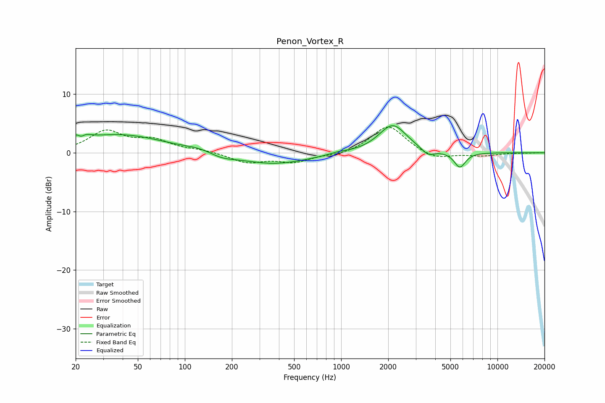

# Penon_Vortex_R
See [usage instructions](https://github.com/jaakkopasanen/AutoEq#usage) for more options and info.

### Parametric EQs
Apply preamp of -4.7 dB when using parametric equalizer.

|   # | Type    |   Fc (Hz) |    Q |   Gain (dB) |
|-----|---------|-----------|------|-------------|
|   1 | Peaking |        21 | 3.82 |         2.8 |
|   2 | Peaking |        22 | 5.76 |        -2.1 |
|   3 | Peaking |        39 | 0.51 |         3.1 |
|   4 | Peaking |       125 | 1.48 |         0.5 |
|   5 | Peaking |       171 | 1.72 |        -0.8 |
|   6 | Peaking |       369 | 0.63 |        -1.9 |
|   7 | Peaking |       966 | 2.47 |         0.3 |
|   8 | Peaking |      2137 | 1.58 |         4.9 |
|   9 | Peaking |      3594 | 3.41 |        -1.2 |
|  10 | Peaking |      5746 | 3.77 |        -2.6 |

### Fixed Band EQs
When using fixed band (also called graphic) equalizer, apply preamp of **-4.5 dB** (if available) and set gains manually with these parameters.

|   # | Type    |   Fc (Hz) |    Q |   Gain (dB) |
|-----|---------|-----------|------|-------------|
|   1 | Peaking |        31 | 1.41 |         3.5 |
|   2 | Peaking |        62 | 1.41 |         1.9 |
|   3 | Peaking |       125 | 1.41 |         0.4 |
|   4 | Peaking |       250 | 1.41 |        -1.6 |
|   5 | Peaking |       500 | 1.41 |        -1.5 |
|   6 | Peaking |      1000 | 1.41 |        -0.5 |
|   7 | Peaking |      2000 | 1.41 |         4.8 |
|   8 | Peaking |      4000 | 1.41 |        -1.2 |
|   9 | Peaking |      8000 | 1.41 |        -0.5 |
|  10 | Peaking |     16000 | 1.41 |        -0   |

### Graphs

