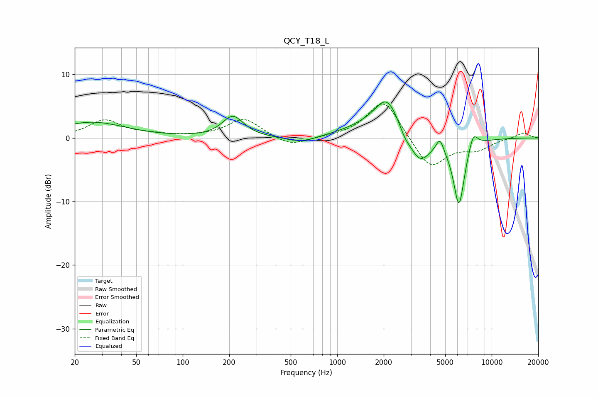

# QCY_T18_L
See [usage instructions](https://github.com/jaakkopasanen/AutoEq#usage) for more options and info.

### Parametric EQs
Apply preamp of -5.7 dB when using parametric equalizer.

|   # | Type    |   Fc (Hz) |    Q |   Gain (dB) |
|-----|---------|-----------|------|-------------|
|   1 | Peaking |        26 | 0.66 |         2.5 |
|   2 | Peaking |       211 | 2.07 |         3.3 |
|   3 | Peaking |       584 | 1.47 |        -1   |
|   4 | Peaking |      1547 | 0.86 |         1.3 |
|   5 | Peaking |      2103 | 1.76 |         5.6 |
|   6 | Peaking |      2746 | 3.96 |        -1.1 |
|   7 | Peaking |      3423 | 2.1  |        -4.3 |
|   8 | Peaking |      4620 | 5.89 |         2.1 |
|   9 | Peaking |      6140 | 3.63 |       -10.7 |
|  10 | Peaking |      7581 | 4.45 |         2.7 |

### Fixed Band EQs
When using fixed band (also called graphic) equalizer, apply preamp of **-5.4 dB** (if available) and set gains manually with these parameters.

|   # | Type    |   Fc (Hz) |    Q |   Gain (dB) |
|-----|---------|-----------|------|-------------|
|   1 | Peaking |        31 | 1.41 |         2.7 |
|   2 | Peaking |        62 | 1.41 |         0.4 |
|   3 | Peaking |       125 | 1.41 |         0.1 |
|   4 | Peaking |       250 | 1.41 |         3   |
|   5 | Peaking |       500 | 1.41 |        -1.4 |
|   6 | Peaking |      1000 | 1.41 |         0.1 |
|   7 | Peaking |      2000 | 1.41 |         6.3 |
|   8 | Peaking |      4000 | 1.41 |        -5   |
|   9 | Peaking |      8000 | 1.41 |        -1.6 |
|  10 | Peaking |     16000 | 1.41 |         0.9 |

### Graphs

