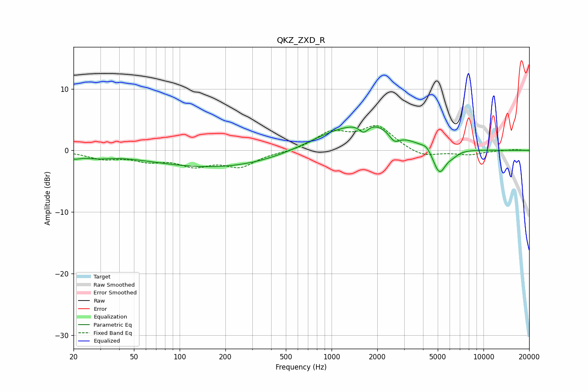

# QKZ_ZXD_R
See [usage instructions](https://github.com/jaakkopasanen/AutoEq#usage) for more options and info.

### Parametric EQs
Apply preamp of -3.9 dB when using parametric equalizer.

|   # | Type    |   Fc (Hz) |    Q |   Gain (dB) |
|-----|---------|-----------|------|-------------|
|   1 | Peaking |        20 | 3.37 |        -0.8 |
|   2 | Peaking |        28 | 1.55 |        -0.7 |
|   3 | Peaking |       175 | 0.32 |        -2.8 |
|   4 | Peaking |       995 | 0.67 |         2   |
|   5 | Peaking |      1627 | 4.64 |        -1.5 |
|   6 | Peaking |      1850 | 0.78 |         3.7 |
|   7 | Peaking |      2594 | 3.99 |        -1.6 |
|   8 | Peaking |      4222 | 4.66 |         0.7 |
|   9 | Peaking |      5130 | 3.23 |        -4.3 |
|  10 | Peaking |      6300 | 3.75 |        -0.6 |

### Fixed Band EQs
When using fixed band (also called graphic) equalizer, apply preamp of **-4.1 dB** (if available) and set gains manually with these parameters.

|   # | Type    |   Fc (Hz) |    Q |   Gain (dB) |
|-----|---------|-----------|------|-------------|
|   1 | Peaking |        31 | 1.41 |        -1.2 |
|   2 | Peaking |        62 | 1.41 |        -1.4 |
|   3 | Peaking |       125 | 1.41 |        -2.1 |
|   4 | Peaking |       250 | 1.41 |        -2.4 |
|   5 | Peaking |       500 | 1.41 |        -0.2 |
|   6 | Peaking |      1000 | 1.41 |         2.7 |
|   7 | Peaking |      2000 | 1.41 |         3.7 |
|   8 | Peaking |      4000 | 1.41 |        -1.2 |
|   9 | Peaking |      8000 | 1.41 |        -0.7 |
|  10 | Peaking |     16000 | 1.41 |         0.2 |

### Graphs

