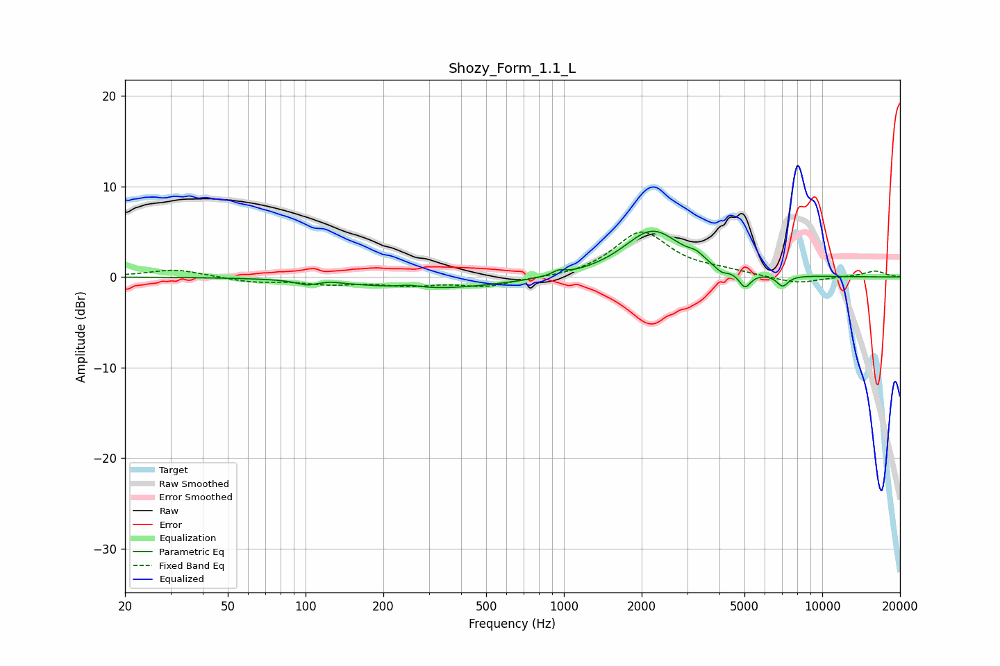

# Shozy_Form_1.1_L
See [usage instructions](https://github.com/jaakkopasanen/AutoEq#usage) for more options and info.

### Parametric EQs
Apply preamp of -5.2 dB when using parametric equalizer.

|   # | Type    |   Fc (Hz) |    Q |   Gain (dB) |
|-----|---------|-----------|------|-------------|
|   1 | Peaking |       101 | 3.88 |        -0.5 |
|   2 | Peaking |       126 | 4.49 |         0.1 |
|   3 | Peaking |       252 | 3.27 |         0.3 |
|   4 | Peaking |       314 | 0.5  |        -1.3 |
|   5 | Peaking |       955 | 6    |         0.5 |
|   6 | Peaking |      2204 | 1.27 |         5.1 |
|   7 | Peaking |      3255 | 4.7  |         0.7 |
|   8 | Peaking |      4068 | 5.71 |        -0.6 |
|   9 | Peaking |      5020 | 6    |        -1.7 |
|  10 | Peaking |      7023 | 6    |        -1.2 |

### Fixed Band EQs
When using fixed band (also called graphic) equalizer, apply preamp of **-5.1 dB** (if available) and set gains manually with these parameters.

|   # | Type    |   Fc (Hz) |    Q |   Gain (dB) |
|-----|---------|-----------|------|-------------|
|   1 | Peaking |        31 | 1.41 |         0.9 |
|   2 | Peaking |        62 | 1.41 |        -0.5 |
|   3 | Peaking |       125 | 1.41 |        -0.7 |
|   4 | Peaking |       250 | 1.41 |        -0.8 |
|   5 | Peaking |       500 | 1.41 |        -1   |
|   6 | Peaking |      1000 | 1.41 |        -0.2 |
|   7 | Peaking |      2000 | 1.41 |         5   |
|   8 | Peaking |      4000 | 1.41 |         0.5 |
|   9 | Peaking |      8000 | 1.41 |        -0.8 |
|  10 | Peaking |     16000 | 1.41 |         0.7 |

### Graphs

