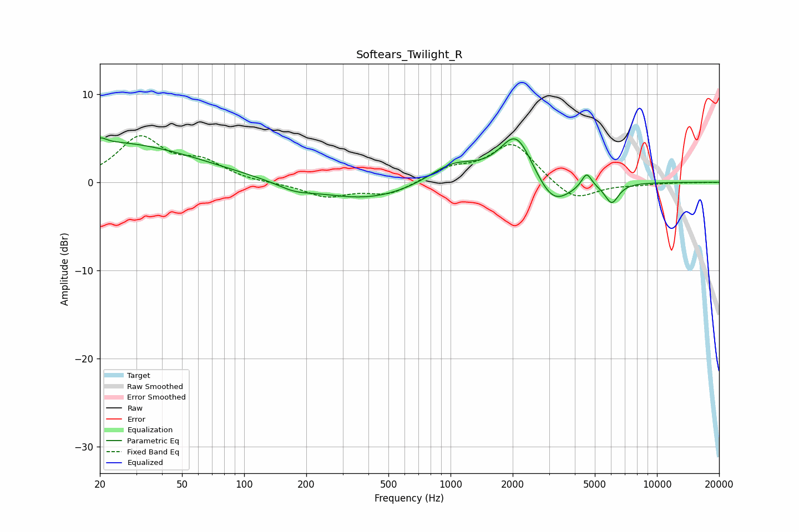

# Softears_Twilight_R
See [usage instructions](https://github.com/jaakkopasanen/AutoEq#usage) for more options and info.

### Parametric EQs
Apply preamp of -5.1 dB when using parametric equalizer.

|   # | Type    |   Fc (Hz) |    Q |   Gain (dB) |
|-----|---------|-----------|------|-------------|
|   1 | Peaking |        20 | 6    |        -2.4 |
|   2 | Peaking |        20 | 5.93 |         3   |
|   3 | Peaking |        22 | 0.32 |         4.5 |
|   4 | Peaking |       175 | 1.74 |        -0.7 |
|   5 | Peaking |       395 | 0.57 |        -2.1 |
|   6 | Peaking |      1032 | 1.16 |         2.3 |
|   7 | Peaking |      2082 | 1.76 |         5.6 |
|   8 | Peaking |      3133 | 1.68 |        -3.3 |
|   9 | Peaking |      4562 | 5.74 |         1.7 |
|  10 | Peaking |      6038 | 4.16 |        -2.2 |

### Fixed Band EQs
When using fixed band (also called graphic) equalizer, apply preamp of **-5.4 dB** (if available) and set gains manually with these parameters.

|   # | Type    |   Fc (Hz) |    Q |   Gain (dB) |
|-----|---------|-----------|------|-------------|
|   1 | Peaking |        31 | 1.41 |         4.9 |
|   2 | Peaking |        62 | 1.41 |         2   |
|   3 | Peaking |       125 | 1.41 |        -0.1 |
|   4 | Peaking |       250 | 1.41 |        -1.6 |
|   5 | Peaking |       500 | 1.41 |        -1.4 |
|   6 | Peaking |      1000 | 1.41 |         1.4 |
|   7 | Peaking |      2000 | 1.41 |         4.4 |
|   8 | Peaking |      4000 | 1.41 |        -2.3 |
|   9 | Peaking |      8000 | 1.41 |        -0.2 |
|  10 | Peaking |     16000 | 1.41 |        -0   |

### Graphs

