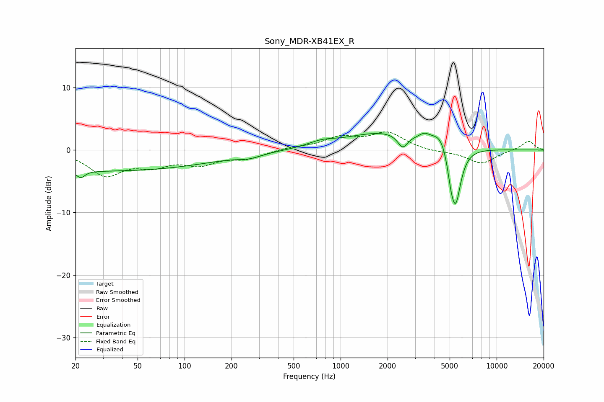

# Sony_MDR-XB41EX_R
See [usage instructions](https://github.com/jaakkopasanen/AutoEq#usage) for more options and info.

### Parametric EQs
Apply preamp of -2.8 dB when using parametric equalizer.

|   # | Type    |   Fc (Hz) |    Q |   Gain (dB) |
|-----|---------|-----------|------|-------------|
|   1 | Peaking |        22 | 5.29 |        -1.1 |
|   2 | Peaking |        31 | 0.18 |        -3.3 |
|   3 | Peaking |       262 | 1.94 |        -0.6 |
|   4 | Peaking |       755 | 1.67 |         0.8 |
|   5 | Peaking |      1868 | 0.59 |         2.8 |
|   6 | Peaking |      2499 | 4.53 |        -2.1 |
|   7 | Peaking |      3438 | 3.91 |         0.9 |
|   8 | Peaking |      4417 | 2.43 |         2.6 |
|   9 | Peaking |      5093 | 6    |        -2.6 |
|  10 | Peaking |      5464 | 3.96 |        -9.1 |

### Fixed Band EQs
When using fixed band (also called graphic) equalizer, apply preamp of **-3.0 dB** (if available) and set gains manually with these parameters.

|   # | Type    |   Fc (Hz) |    Q |   Gain (dB) |
|-----|---------|-----------|------|-------------|
|   1 | Peaking |        31 | 1.41 |        -3.8 |
|   2 | Peaking |        62 | 1.41 |        -2   |
|   3 | Peaking |       125 | 1.41 |        -2   |
|   4 | Peaking |       250 | 1.41 |        -1.2 |
|   5 | Peaking |       500 | 1.41 |         0.4 |
|   6 | Peaking |      1000 | 1.41 |         1.9 |
|   7 | Peaking |      2000 | 1.41 |         2.7 |
|   8 | Peaking |      4000 | 1.41 |        -0.3 |
|   9 | Peaking |      8000 | 1.41 |        -2.2 |
|  10 | Peaking |     16000 | 1.41 |         1.5 |

### Graphs

