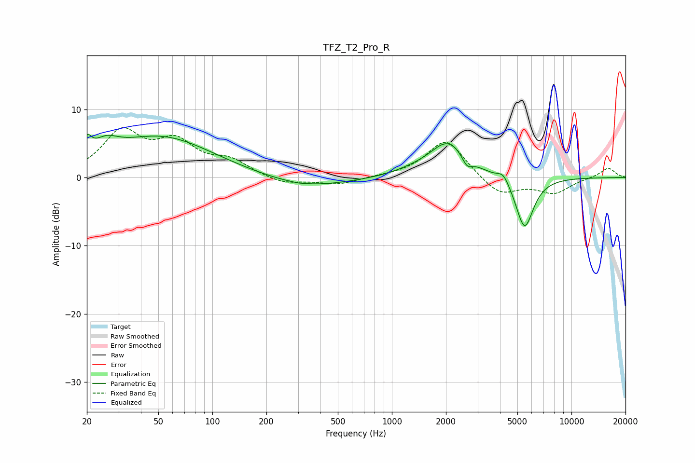

# TFZ_T2_Pro_R
See [usage instructions](https://github.com/jaakkopasanen/AutoEq#usage) for more options and info.

### Parametric EQs
Apply preamp of -6.4 dB when using parametric equalizer.

|   # | Type    |   Fc (Hz) |    Q |   Gain (dB) |
|-----|---------|-----------|------|-------------|
|   1 | Peaking |        20 | 6    |         2.4 |
|   2 | Peaking |        25 | 2.04 |         2.1 |
|   3 | Peaking |        52 | 0.49 |         5.9 |
|   4 | Peaking |       302 | 5.95 |        -0.1 |
|   5 | Peaking |       334 | 0.62 |        -1.6 |
|   6 | Peaking |      1286 | 1.33 |         0.5 |
|   7 | Peaking |      2060 | 1.36 |         5.2 |
|   8 | Peaking |      2620 | 4.92 |        -1.6 |
|   9 | Peaking |      4181 | 4.15 |         1.5 |
|  10 | Peaking |      5480 | 2.77 |        -7.7 |

### Fixed Band EQs
When using fixed band (also called graphic) equalizer, apply preamp of **-7.4 dB** (if available) and set gains manually with these parameters.

|   # | Type    |   Fc (Hz) |    Q |   Gain (dB) |
|-----|---------|-----------|------|-------------|
|   1 | Peaking |        31 | 1.41 |         6.4 |
|   2 | Peaking |        62 | 1.41 |         4.6 |
|   3 | Peaking |       125 | 1.41 |         2.1 |
|   4 | Peaking |       250 | 1.41 |        -1   |
|   5 | Peaking |       500 | 1.41 |        -1   |
|   6 | Peaking |      1000 | 1.41 |         0.1 |
|   7 | Peaking |      2000 | 1.41 |         5.7 |
|   8 | Peaking |      4000 | 1.41 |        -2.7 |
|   9 | Peaking |      8000 | 1.41 |        -2.2 |
|  10 | Peaking |     16000 | 1.41 |         1.5 |

### Graphs

