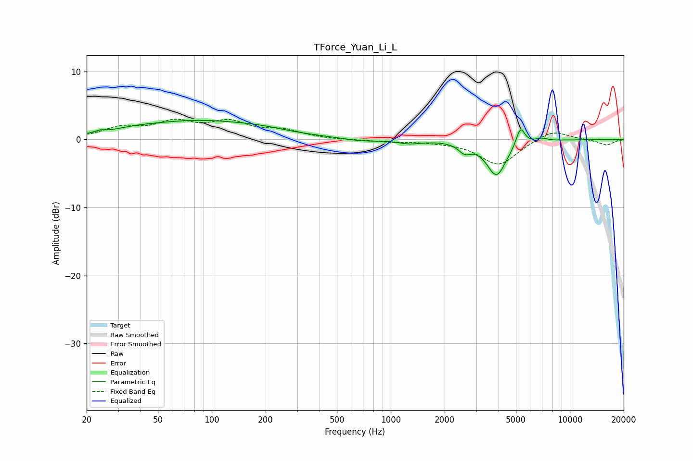

# TForce_Yuan_Li_L
See [usage instructions](https://github.com/jaakkopasanen/AutoEq#usage) for more options and info.

### Parametric EQs
Apply preamp of -2.9 dB when using parametric equalizer.

|   # | Type    |   Fc (Hz) |    Q |   Gain (dB) |
|-----|---------|-----------|------|-------------|
|   1 | Peaking |        24 | 5.99 |         0.3 |
|   2 | Peaking |        37 | 1.51 |         0.2 |
|   3 | Peaking |        83 | 0.4  |         2.7 |
|   4 | Peaking |       192 | 1.12 |         0.3 |
|   5 | Peaking |       679 | 1.68 |        -0.4 |
|   6 | Peaking |      1271 | 2.13 |        -0.5 |
|   7 | Peaking |      2589 | 4.13 |        -1.3 |
|   8 | Peaking |      3895 | 2.54 |        -5.2 |
|   9 | Peaking |      5305 | 5.85 |         2.7 |
|  10 | Peaking |      6924 | 4.05 |         0.4 |

### Fixed Band EQs
When using fixed band (also called graphic) equalizer, apply preamp of **-3.1 dB** (if available) and set gains manually with these parameters.

|   # | Type    |   Fc (Hz) |    Q |   Gain (dB) |
|-----|---------|-----------|------|-------------|
|   1 | Peaking |        31 | 1.41 |         1.6 |
|   2 | Peaking |        62 | 1.41 |         2.2 |
|   3 | Peaking |       125 | 1.41 |         2.3 |
|   4 | Peaking |       250 | 1.41 |         1.2 |
|   5 | Peaking |       500 | 1.41 |        -0.1 |
|   6 | Peaking |      1000 | 1.41 |        -0.3 |
|   7 | Peaking |      2000 | 1.41 |        -0.2 |
|   8 | Peaking |      4000 | 1.41 |        -3.8 |
|   9 | Peaking |      8000 | 1.41 |         1.5 |
|  10 | Peaking |     16000 | 1.41 |        -0.8 |

### Graphs

