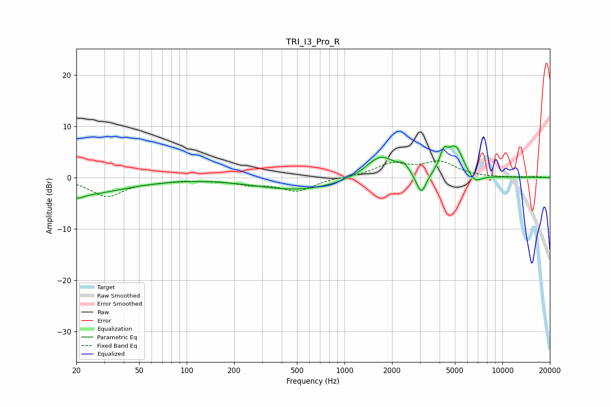

# TRI_I3_Pro_R
See [usage instructions](https://github.com/jaakkopasanen/AutoEq#usage) for more options and info.

### Parametric EQs
Apply preamp of -6.2 dB when using parametric equalizer.

|   # | Type    |   Fc (Hz) |    Q |   Gain (dB) |
|-----|---------|-----------|------|-------------|
|   1 | Peaking |        20 | 0.49 |        -3.3 |
|   2 | Peaking |        20 | 3.56 |        -0.7 |
|   3 | Peaking |       246 | 2.23 |         0   |
|   4 | Peaking |       513 | 0.52 |        -2.4 |
|   5 | Peaking |      1694 | 1.5  |         4.5 |
|   6 | Peaking |      2384 | 4.41 |         1.4 |
|   7 | Peaking |      3063 | 4.41 |        -4.3 |
|   8 | Peaking |      4247 | 5.62 |         3.2 |
|   9 | Peaking |      5040 | 2.69 |         5.8 |
|  10 | Peaking |      6669 | 3.01 |        -1.9 |

### Fixed Band EQs
When using fixed band (also called graphic) equalizer, apply preamp of **-3.3 dB** (if available) and set gains manually with these parameters.

|   # | Type    |   Fc (Hz) |    Q |   Gain (dB) |
|-----|---------|-----------|------|-------------|
|   1 | Peaking |        31 | 1.41 |        -3.6 |
|   2 | Peaking |        62 | 1.41 |        -0.5 |
|   3 | Peaking |       125 | 1.41 |        -0.3 |
|   4 | Peaking |       250 | 1.41 |        -1.1 |
|   5 | Peaking |       500 | 1.41 |        -2.5 |
|   6 | Peaking |      1000 | 1.41 |         0.1 |
|   7 | Peaking |      2000 | 1.41 |         2.5 |
|   8 | Peaking |      4000 | 1.41 |         2.8 |
|   9 | Peaking |      8000 | 1.41 |        -0   |
|  10 | Peaking |     16000 | 1.41 |         0.2 |

### Graphs

