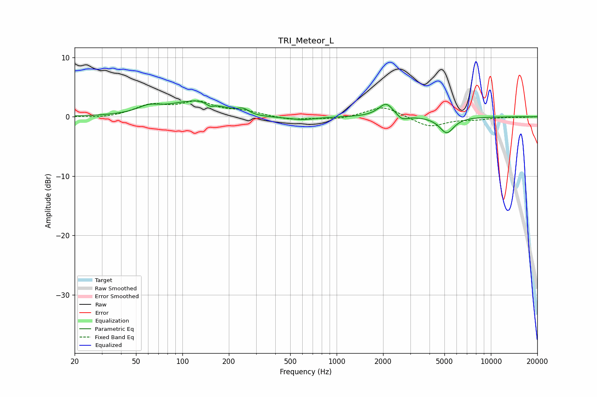

# TRI_Meteor_L
See [usage instructions](https://github.com/jaakkopasanen/AutoEq#usage) for more options and info.

### Parametric EQs
Apply preamp of -2.8 dB when using parametric equalizer.

|   # | Type    |   Fc (Hz) |    Q |   Gain (dB) |
|-----|---------|-----------|------|-------------|
|   1 | Peaking |        60 | 1.93 |         1.1 |
|   2 | Peaking |       128 | 0.81 |         2.8 |
|   3 | Peaking |       152 | 5.64 |        -0.6 |
|   4 | Peaking |       248 | 3.87 |         0.9 |
|   5 | Peaking |       267 | 0.83 |        -0.6 |
|   6 | Peaking |       602 | 1.6  |        -0.5 |
|   7 | Peaking |      1944 | 2.49 |         0.3 |
|   8 | Peaking |      2105 | 3.22 |         2   |
|   9 | Peaking |      2659 | 4.21 |        -0.8 |
|  10 | Peaking |      5173 | 3    |        -2.7 |

### Fixed Band EQs
When using fixed band (also called graphic) equalizer, apply preamp of **-2.8 dB** (if available) and set gains manually with these parameters.

|   # | Type    |   Fc (Hz) |    Q |   Gain (dB) |
|-----|---------|-----------|------|-------------|
|   1 | Peaking |        31 | 1.41 |        -0.3 |
|   2 | Peaking |        62 | 1.41 |         1.8 |
|   3 | Peaking |       125 | 1.41 |         2.2 |
|   4 | Peaking |       250 | 1.41 |         0.8 |
|   5 | Peaking |       500 | 1.41 |        -0.6 |
|   6 | Peaking |      1000 | 1.41 |        -0.5 |
|   7 | Peaking |      2000 | 1.41 |         1.9 |
|   8 | Peaking |      4000 | 1.41 |        -1.8 |
|   9 | Peaking |      8000 | 1.41 |        -0.4 |
|  10 | Peaking |     16000 | 1.41 |        -0.1 |

### Graphs

