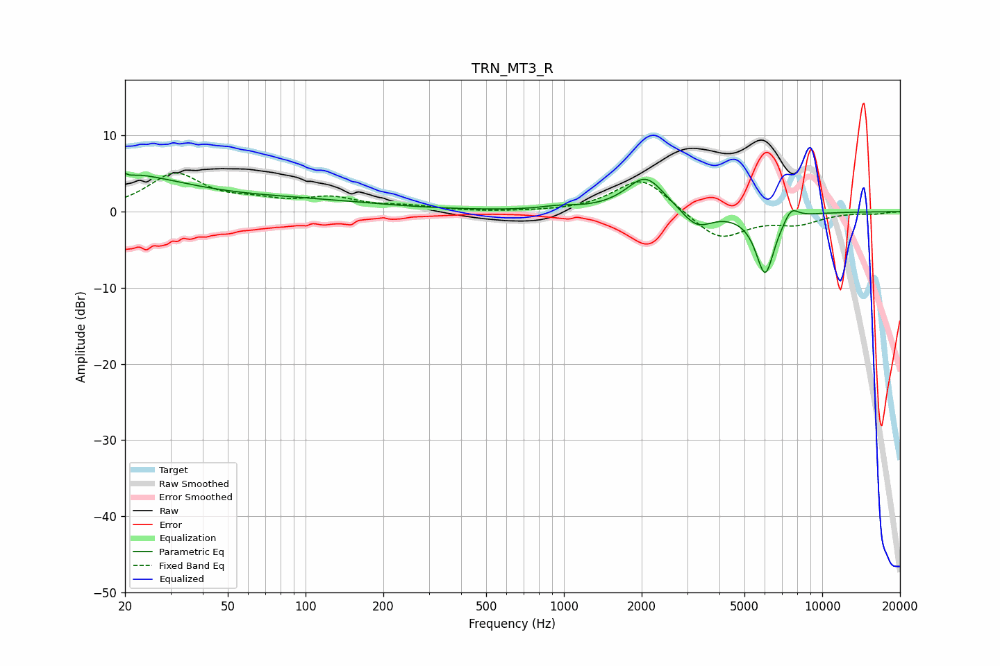

# TRN_MT3_R
See [usage instructions](https://github.com/jaakkopasanen/AutoEq#usage) for more options and info.

### Parametric EQs
Apply preamp of -5.2 dB when using parametric equalizer.

|   # | Type    |   Fc (Hz) |    Q |   Gain (dB) |
|-----|---------|-----------|------|-------------|
|   1 | Peaking |        20 | 0.55 |         4.1 |
|   2 | Peaking |        20 | 5.63 |         3.4 |
|   3 | Peaking |        20 | 5.92 |        -3.3 |
|   4 | Peaking |        21 | 1.17 |         0.5 |
|   5 | Peaking |        94 | 0.43 |         1.3 |
|   6 | Peaking |       955 | 1.99 |         0.4 |
|   7 | Peaking |      2072 | 1.89 |         4.7 |
|   8 | Peaking |      3267 | 2.41 |        -2.4 |
|   9 | Peaking |      6012 | 3.71 |        -8.2 |
|  10 | Peaking |      7583 | 4.7  |         1.7 |

### Fixed Band EQs
When using fixed band (also called graphic) equalizer, apply preamp of **-5.2 dB** (if available) and set gains manually with these parameters.

|   # | Type    |   Fc (Hz) |    Q |   Gain (dB) |
|-----|---------|-----------|------|-------------|
|   1 | Peaking |        31 | 1.41 |         4.8 |
|   2 | Peaking |        62 | 1.41 |         1   |
|   3 | Peaking |       125 | 1.41 |         1.6 |
|   4 | Peaking |       250 | 1.41 |         0.6 |
|   5 | Peaking |       500 | 1.41 |        -0.1 |
|   6 | Peaking |      1000 | 1.41 |        -0.1 |
|   7 | Peaking |      2000 | 1.41 |         4.6 |
|   8 | Peaking |      4000 | 1.41 |        -3.8 |
|   9 | Peaking |      8000 | 1.41 |        -1.4 |
|  10 | Peaking |     16000 | 1.41 |        -0.2 |

### Graphs

