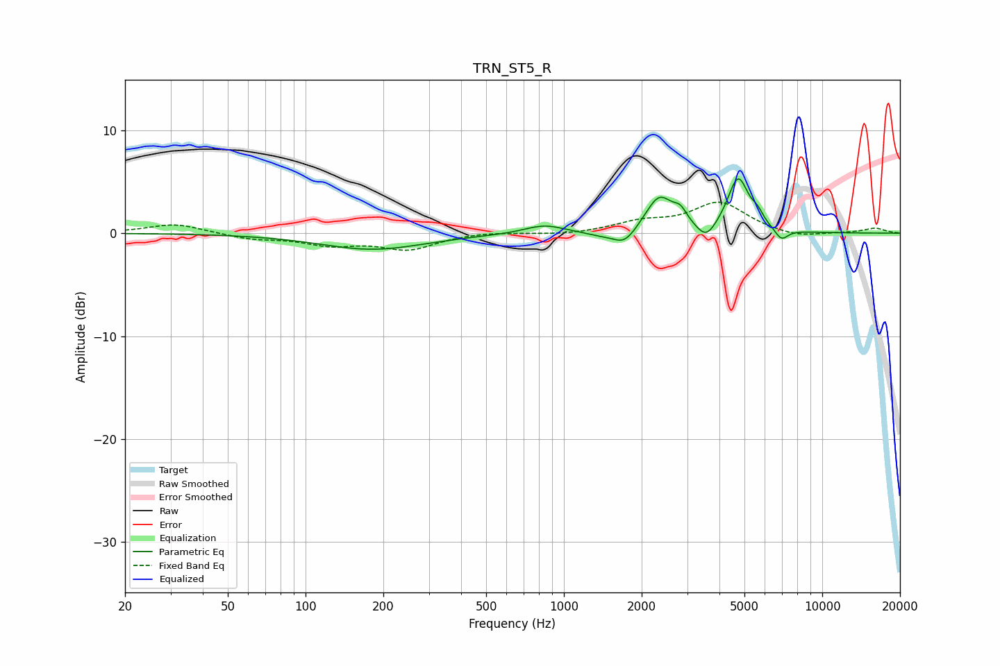

# TRN_ST5_R
See [usage instructions](https://github.com/jaakkopasanen/AutoEq#usage) for more options and info.

### Parametric EQs
Apply preamp of -5.4 dB when using parametric equalizer.

|   # | Type    |   Fc (Hz) |    Q |   Gain (dB) |
|-----|---------|-----------|------|-------------|
|   1 | Peaking |       182 | 0.69 |        -1.6 |
|   2 | Peaking |       839 | 1.83 |         0.9 |
|   3 | Peaking |      1379 | 2.3  |        -0.3 |
|   4 | Peaking |      1719 | 3.11 |        -1.5 |
|   5 | Peaking |      2341 | 2.62 |         3.5 |
|   6 | Peaking |      2828 | 5.47 |         1.2 |
|   7 | Peaking |      3558 | 3.83 |        -1.6 |
|   8 | Peaking |      4726 | 3.43 |         5.2 |
|   9 | Peaking |      5626 | 6    |         0.9 |
|  10 | Peaking |      6949 | 5.29 |        -1.1 |

### Fixed Band EQs
When using fixed band (also called graphic) equalizer, apply preamp of **-3.1 dB** (if available) and set gains manually with these parameters.

|   # | Type    |   Fc (Hz) |    Q |   Gain (dB) |
|-----|---------|-----------|------|-------------|
|   1 | Peaking |        31 | 1.41 |         0.9 |
|   2 | Peaking |        62 | 1.41 |        -0.5 |
|   3 | Peaking |       125 | 1.41 |        -1   |
|   4 | Peaking |       250 | 1.41 |        -1.5 |
|   5 | Peaking |       500 | 1.41 |         0.2 |
|   6 | Peaking |      1000 | 1.41 |        -0.2 |
|   7 | Peaking |      2000 | 1.41 |         1   |
|   8 | Peaking |      4000 | 1.41 |         2.9 |
|   9 | Peaking |      8000 | 1.41 |        -0.5 |
|  10 | Peaking |     16000 | 1.41 |         0.5 |

### Graphs

