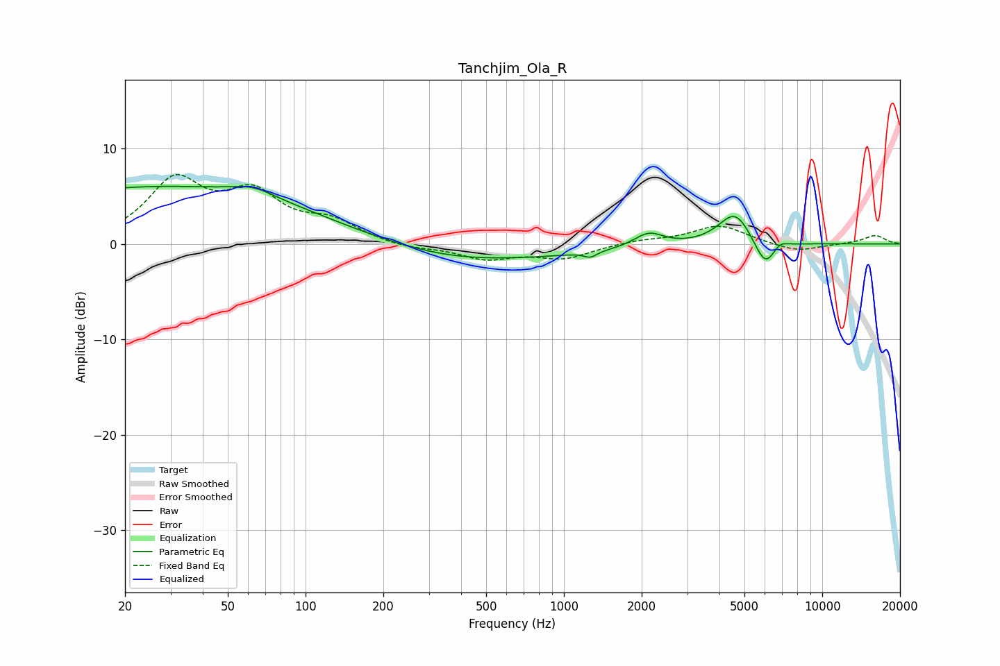

# Tanchjim_Ola_R
See [usage instructions](https://github.com/jaakkopasanen/AutoEq#usage) for more options and info.

### Parametric EQs
Apply preamp of -6.1 dB when using parametric equalizer.

|   # | Type    |   Fc (Hz) |    Q |   Gain (dB) |
|-----|---------|-----------|------|-------------|
|   1 | Peaking |        21 | 4.58 |         0   |
|   2 | Peaking |        29 | 0.21 |         6   |
|   3 | Peaking |        63 | 1.71 |         0.9 |
|   4 | Peaking |       381 | 0.71 |        -0.4 |
|   5 | Peaking |       434 | 0.28 |        -1.6 |
|   6 | Peaking |      1267 | 5.73 |        -0.6 |
|   7 | Peaking |      2129 | 2.48 |         1.5 |
|   8 | Peaking |      4601 | 2.19 |         3.5 |
|   9 | Peaking |      6032 | 3.17 |        -3.1 |
|  10 | Peaking |      6805 | 4.35 |         0.9 |

### Fixed Band EQs
When using fixed band (also called graphic) equalizer, apply preamp of **-7.4 dB** (if available) and set gains manually with these parameters.

|   # | Type    |   Fc (Hz) |    Q |   Gain (dB) |
|-----|---------|-----------|------|-------------|
|   1 | Peaking |        31 | 1.41 |         6.3 |
|   2 | Peaking |        62 | 1.41 |         4.6 |
|   3 | Peaking |       125 | 1.41 |         2   |
|   4 | Peaking |       250 | 1.41 |        -0.5 |
|   5 | Peaking |       500 | 1.41 |        -1.5 |
|   6 | Peaking |      1000 | 1.41 |        -1.4 |
|   7 | Peaking |      2000 | 1.41 |         0.4 |
|   8 | Peaking |      4000 | 1.41 |         2   |
|   9 | Peaking |      8000 | 1.41 |        -0.9 |
|  10 | Peaking |     16000 | 1.41 |         0.9 |

### Graphs

