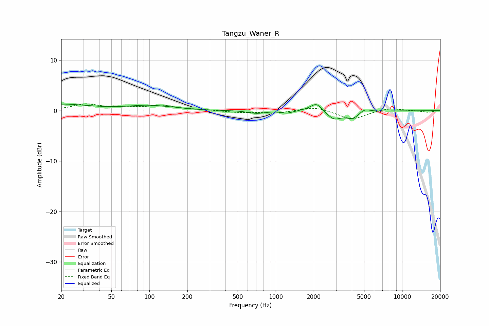

# Tangzu_Waner_R
See [usage instructions](https://github.com/jaakkopasanen/AutoEq#usage) for more options and info.

### Parametric EQs
Apply preamp of -1.4 dB when using parametric equalizer.

|   # | Type    |   Fc (Hz) |    Q |   Gain (dB) |
|-----|---------|-----------|------|-------------|
|   1 | Peaking |        20 | 0.65 |         1.2 |
|   2 | Peaking |        99 | 0.83 |         0.9 |
|   3 | Peaking |       159 | 2.79 |         0.1 |
|   4 | Peaking |       706 | 2.2  |        -0.5 |
|   5 | Peaking |      1226 | 3.45 |        -0.5 |
|   6 | Peaking |      1891 | 2.85 |         0.4 |
|   7 | Peaking |      2110 | 3.68 |         1.4 |
|   8 | Peaking |      2891 | 2.81 |        -1.5 |
|   9 | Peaking |      4096 | 2.22 |        -1.6 |
|  10 | Peaking |      5001 | 3.14 |         1   |

### Fixed Band EQs
When using fixed band (also called graphic) equalizer, apply preamp of **-1.4 dB** (if available) and set gains manually with these parameters.

|   # | Type    |   Fc (Hz) |    Q |   Gain (dB) |
|-----|---------|-----------|------|-------------|
|   1 | Peaking |        31 | 1.41 |         1.2 |
|   2 | Peaking |        62 | 1.41 |         0.5 |
|   3 | Peaking |       125 | 1.41 |         1   |
|   4 | Peaking |       250 | 1.41 |         0.2 |
|   5 | Peaking |       500 | 1.41 |        -0.3 |
|   6 | Peaking |      1000 | 1.41 |        -0.5 |
|   7 | Peaking |      2000 | 1.41 |         0.8 |
|   8 | Peaking |      4000 | 1.41 |        -1.8 |
|   9 | Peaking |      8000 | 1.41 |         0.6 |
|  10 | Peaking |     16000 | 1.41 |        -0.3 |

### Graphs

