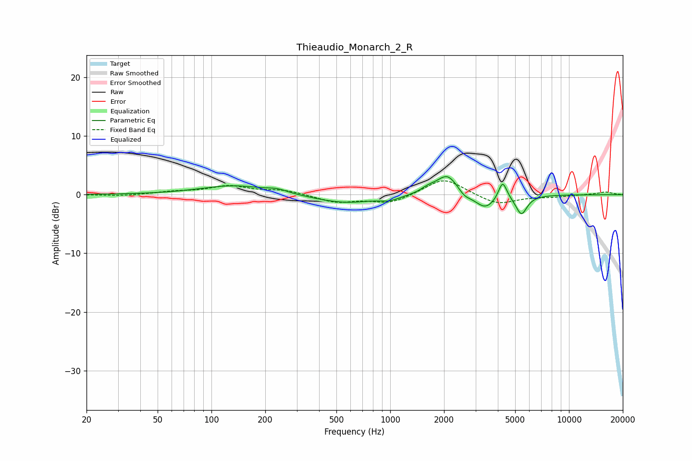

# Thieaudio_Monarch_2_R
See [usage instructions](https://github.com/jaakkopasanen/AutoEq#usage) for more options and info.

### Parametric EQs
Apply preamp of -3.2 dB when using parametric equalizer.

|   # | Type    |   Fc (Hz) |    Q |   Gain (dB) |
|-----|---------|-----------|------|-------------|
|   1 | Peaking |       133 | 0.76 |         1.6 |
|   2 | Peaking |       233 | 2.55 |         0.5 |
|   3 | Peaking |       553 | 0.85 |        -1.5 |
|   4 | Peaking |       993 | 2.69 |        -0.6 |
|   5 | Peaking |      1634 | 3.17 |         0.8 |
|   6 | Peaking |      2088 | 2.43 |         3.5 |
|   7 | Peaking |      2604 | 4.54 |        -0.8 |
|   8 | Peaking |      3404 | 2.38 |        -2.5 |
|   9 | Peaking |      4254 | 5.97 |         3.2 |
|  10 | Peaking |      5420 | 4.46 |        -3.3 |

### Fixed Band EQs
When using fixed band (also called graphic) equalizer, apply preamp of **-2.4 dB** (if available) and set gains manually with these parameters.

|   # | Type    |   Fc (Hz) |    Q |   Gain (dB) |
|-----|---------|-----------|------|-------------|
|   1 | Peaking |        31 | 1.41 |        -0.2 |
|   2 | Peaking |        62 | 1.41 |         0.4 |
|   3 | Peaking |       125 | 1.41 |         1.4 |
|   4 | Peaking |       250 | 1.41 |         0.7 |
|   5 | Peaking |       500 | 1.41 |        -1.3 |
|   6 | Peaking |      1000 | 1.41 |        -1.5 |
|   7 | Peaking |      2000 | 1.41 |         3   |
|   8 | Peaking |      4000 | 1.41 |        -1.7 |
|   9 | Peaking |      8000 | 1.41 |        -0.3 |
|  10 | Peaking |     16000 | 1.41 |         0.5 |

### Graphs

