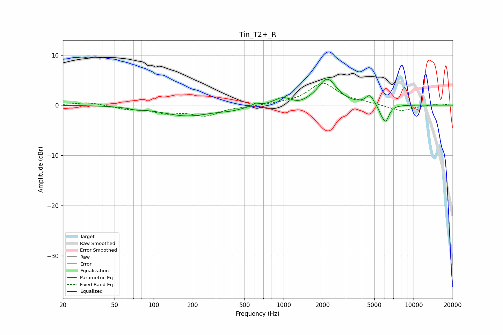

# Tin_T2+_R
See [usage instructions](https://github.com/jaakkopasanen/AutoEq#usage) for more options and info.

### Parametric EQs
Apply preamp of -5.3 dB when using parametric equalizer.

|   # | Type    |   Fc (Hz) |    Q |   Gain (dB) |
|-----|---------|-----------|------|-------------|
|   1 | Peaking |        73 | 2.99 |        -0.3 |
|   2 | Peaking |       181 | 0.72 |        -2.1 |
|   3 | Peaking |       397 | 1.59 |        -0.5 |
|   4 | Peaking |       609 | 5.97 |         0.6 |
|   5 | Peaking |       980 | 2.22 |         1.4 |
|   6 | Peaking |      1303 | 3    |        -0.4 |
|   7 | Peaking |      2165 | 2.01 |         5.1 |
|   8 | Peaking |      4600 | 4.67 |         1.9 |
|   9 | Peaking |      5624 | 6    |        -0.8 |
|  10 | Peaking |      6096 | 5.03 |        -3.2 |

### Fixed Band EQs
When using fixed band (also called graphic) equalizer, apply preamp of **-4.5 dB** (if available) and set gains manually with these parameters.

|   # | Type    |   Fc (Hz) |    Q |   Gain (dB) |
|-----|---------|-----------|------|-------------|
|   1 | Peaking |        31 | 1.41 |         0.6 |
|   2 | Peaking |        62 | 1.41 |        -0.7 |
|   3 | Peaking |       125 | 1.41 |        -1.4 |
|   4 | Peaking |       250 | 1.41 |        -1.9 |
|   5 | Peaking |       500 | 1.41 |        -0.2 |
|   6 | Peaking |      1000 | 1.41 |         0.2 |
|   7 | Peaking |      2000 | 1.41 |         4.3 |
|   8 | Peaking |      4000 | 1.41 |         0.4 |
|   9 | Peaking |      8000 | 1.41 |        -1.2 |
|  10 | Peaking |     16000 | 1.41 |         0.3 |

### Graphs

